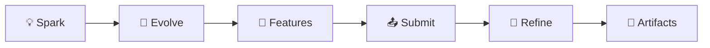

# PoAppIdea

[](https://dotnet.microsoft.com/)
[](https://blazor.net/)
[](https://azure.microsoft.com/)
[](tests/)
[](LICENSE)

> **The Self-Evolving Ideation Engine** — Transform vague app concepts into professional product specifications through AI-powered swiping, synthesis, and artifact generation.

 



---

## ✨ What is PoAppIdea?

PoAppIdea is an innovative brainstorming platform that helps creators evolve their app ideas through:

| Phase | What Happens | Output |
|-------|-------------|--------|
| ⚡ **Spark** | Tinder-style swiping on 20 AI-generated ideas | Top 3 favorites |
| 🧬 **Evolve** | AI mutates & combines your top ideas | 9 evolved concepts |
| 🎯 **Features** | Detailed feature variations with MoSCoW priorities | 50 feature sets |
| 📤 **Submit** | Select 1-10 ideas for synthesis | Unified concept |
| 💬 **Refine** | Answer PM & Architect questions | Refined specification |
| 📄 **Artifacts** | Generate PRD, Tech Doc, Visual Pack | Complete spec package |

---

## 🏗️ Architecture

```
┌──────────────────────────────────────────────────────────────┐
│                    PoAppIdea Platform                         │
├──────────────────────────────────────────────────────────────┤
│  ┌─────────────┐  ┌─────────────┐  ┌─────────────────────┐   │
│  │   Blazor    │  │  Minimal    │  │    Infrastructure   │   │
│  │   Server    │  │   APIs      │  │  (AI, Storage, Auth)│   │
│  └─────────────┘  └─────────────┘  └─────────────────────┘   │
├──────────────────────────────────────────────────────────────┤
│  PoAppIdea.Core (Entities) │ PoAppIdea.Shared (DTOs)         │
└──────────────────────────────────────────────────────────────┘
         │                    │                    │
         ▼                    ▼                    ▼
   ┌──────────┐        ┌──────────┐        ┌──────────┐
   │  Azure   │        │  Azure   │        │   App    │
   │  OpenAI  │        │ Storage  │        │ Insights │
   └──────────┘        └──────────┘        └──────────┘
```

### Tech Stack

| Component | Technology |
|-----------|------------|
| **Frontend** | Blazor Server + Radzen 5.4 |
| **Backend** | .NET 10, Minimal APIs |
| **AI** | Azure OpenAI (GPT-4o, DALL-E 3) |
| **Storage** | Azure Table + Blob Storage |
| **Auth** | OAuth (Google, GitHub, Microsoft) |
| **Telemetry** | OpenTelemetry → Application Insights |

---

## 🚀 Quick Start

### Prerequisites

- [.NET 10 SDK](https://dotnet.microsoft.com/download)
- [Azurite](https://docs.microsoft.com/en-us/azure/storage/common/storage-use-azurite) (Azure Storage emulator)
- Azure OpenAI resource (or use mock mode)

### Setup

```bash
# Clone
git clone https://github.com/your-org/PoAppIdea.git
cd PoAppIdea

# Configure secrets
cd src/PoAppIdea.Web
dotnet user-secrets init
dotnet user-secrets set "AzureStorage:ConnectionString" "UseDevelopmentStorage=true"
dotnet user-secrets set "AzureOpenAI:Endpoint" "https://YOUR-RESOURCE.openai.azure.com/"
dotnet user-secrets set "AzureOpenAI:ApiKey" "YOUR-API-KEY"

# Start Azurite (Docker)
cd ../..
docker compose -f docker-compose.azurite.yml up -d

# Run
cd src/PoAppIdea.Web
dotnet run
```

Open https://localhost:5001

### Mock Mode (No AI Costs)

Set `UseMockAI: true` in `appsettings.Development.json` to use mock AI services.

---

## 📁 Project Structure

```
PoAppIdea/
├── src/
│   ├── PoAppIdea.Web/           # Main Blazor application
│   │   ├── Components/          # Pages (14) and shared components
│   │   ├── Features/            # 11 VSA feature modules
│   │   └── Infrastructure/      # AI, Storage, Auth, Telemetry
│   ├── PoAppIdea.Core/          # Domain entities (11) and interfaces
│   └── PoAppIdea.Shared/        # DTOs and contracts
├── tests/
│   ├── PoAppIdea.UnitTests/     # xUnit unit tests
│   ├── PoAppIdea.IntegrationTests/  # API integration tests
│   └── PoAppIdea.E2E/           # Playwright E2E tests
├── docs/                        # Documentation
│   ├── mermaid/                 # Architecture diagrams
│   ├── product/                 # PRD, Features, Architecture
│   ├── kql/                     # Observability queries
│   └── mapping/                 # Config mappings
└── infra/                       # Bicep IaC
```

---

## 📡 API Endpoints

| Endpoint | Method | Description |
|----------|--------|-------------|
| `/api/sessions` | POST | Create session |
| `/api/sessions/{id}/ideas` | POST | Generate ideas |
| `/api/sessions/{id}/swipes` | POST | Record swipe |
| `/api/sessions/{id}/mutations` | POST | Generate mutations |
| `/api/sessions/{id}/features` | POST | Expand features |
| `/api/sessions/{id}/synthesis` | POST | Synthesize ideas |
| `/api/sessions/{id}/refinement` | POST | Submit answers |
| `/api/sessions/{id}/artifacts` | POST | Generate artifacts |
| `/health` | GET | Health check |

**API Documentation**: `/scalar/v1` (development)

---

## 🧪 Testing

```bash
# Unit tests
cd tests/PoAppIdea.UnitTests
dotnet test

# Integration tests
cd tests/PoAppIdea.IntegrationTests
dotnet test

# E2E tests (Playwright)
cd tests/PoAppIdea.E2E
npm install && npx playwright install chromium
npm test
```

---

## 🚢 Deployment

### Azure Resources

| Resource | Purpose |
|----------|---------|
| App Service | Web hosting |
| Storage Account | Tables + Blobs |
| Azure OpenAI | GPT-4o, DALL-E 3 |
| Key Vault | Production secrets |
| Application Insights | Monitoring |

### Deploy with Bicep

```bash
az deployment group create \
  --resource-group PoAppIdea \
  --template-file infra/main.bicep \
  --parameters infra/main.bicepparam
```

---

## 📚 📚 Documentation Hub

Complete documentation organized for **humans** and **AI agents**. Each topic has regular and simplified versions for quick reference.

### 🎯 Start Here by Role

#### 👨‍💻 **Developers (Getting Started)**
- [LocalSetup.md](docs/LocalSetup.md) — Day 1 setup guide with Docker & secrets
- [ComponentMap-SIMPLE.md](docs/ComponentMap-SIMPLE.md) — Quick reference: pages, services, repos
- [Architecture-SIMPLE.md](docs/Architecture-SIMPLE.md) — How the system connects

#### 🏗️ **Architects & Tech Leads**
- [Architecture-FULL.md](docs/Architecture-FULL.md) — Deep dive: C4 context, containers, security layers
- [DataModel-FULL.md](docs/DataModel-FULL.md) — Complete ERD, storage schema, indexing
- [ComponentMap-FULL.md](docs/ComponentMap-FULL.md) — Full component tree, service interactions
- [DataPipeline-FULL.md](docs/DataPipeline-FULL.md) — Data flow, CRUD patterns, validation pipeline

#### 📊 **Product Managers & Stakeholders**
- [ProductSpec.md](docs/ProductSpec.md) — Requirements, metrics, success criteria
- [ApplicationFlow-SIMPLE.md](docs/ApplicationFlow-SIMPLE.md) — 7-phase journey, key flows

#### 🤖 **AI Agents & Code Generators**
- [ProjectManifest.md](docs/ProjectManifest.md) — **Start here!** Inventory of all documentation
- [DataModel-FULL.md](docs/DataModel-FULL.md) — Entity structure for code generation
- [ApiContract.md](docs/ApiContract.md) — REST API specs, error codes
- [DevOps.md](docs/DevOps.md) — CI/CD pipeline, configuration

---

### 📖 Complete Documentation Index

#### Architecture & System Design

| Document | Quick Version | Detailed Version | Purpose |
|----------|---|---|---------|
| **System Architecture** | [Simple](docs/Architecture-SIMPLE.md) | [Full](docs/Architecture-FULL.md) | C4 context, containers, infrastructure topology |
| **Application Flow** | [Simple](docs/ApplicationFlow-SIMPLE.md) | [Full](docs/ApplicationFlow-FULL.md) | Auth flow, user journey, page transitions |
| **Data Model** | [Simple](docs/DataModel-SIMPLE.md) | [Full](docs/DataModel-FULL.md) | ERD, schema, storage patterns |
| **Components Map** | [Simple](docs/ComponentMap-SIMPLE.md) | [Full](docs/ComponentMap-FULL.md) | Pages, services, dependencies |
| **Data Pipeline** | [Simple](docs/DataPipeline-SIMPLE.md) | [Full](docs/DataPipeline-FULL.md) | CRUD operations, validation, async processing |

#### Product & Technical Specifications

| Document | Purpose | Audience |
|----------|---------|----------|
| [ProductSpec.md](docs/ProductSpec.md) | PRD, success metrics, roadmap | Product managers, stakeholders |
| [ApiContract.md](docs/ApiContract.md) | REST API endpoints, error handling, rate limits | API consumers, frontend developers |
| [LocalSetup.md](docs/LocalSetup.md) | Environment setup, Docker, secrets configuration | New developers, onboarding |
| [DevOps.md](docs/DevOps.md) | CI/CD pipeline, Azure resources, monitoring | DevOps engineers, platform teams |
| [ProjectManifest.md](docs/ProjectManifest.md) | Documentation inventory for AI agents | AI assistants, code generators |

---

### 🔍 Mermaid Diagrams (Original Files)

The following `.mmd` files contain the rendered diagrams (view in VS Code or GitHub):
- [Architecture.mmd](docs/Architecture.mmd) — Original architecture diagram
- [ApplicationFlow.mmd](docs/ApplicationFlow.mmd) — Original application flow
- [DataModel.mmd](docs/DataModel.mmd) — Original ERD diagram
- [ComponentMap.mmd](docs/ComponentMap.mmd) — Original component map
- [DataPipeline.mmd](docs/DataPipeline.mmd) — Original data pipeline

> **Tip:** The markdown versions (e.g., `Architecture-FULL.md`) contain the same diagrams wrapped in mermaid code fences for easy viewing in markdown viewers.

---

### 💡 How to Use This Documentation

| Need | Action |
|------|--------|
| **Quick answer** | Use the "SIMPLE" versions (5 min read) |
| **Deep understanding** | Use the "FULL" versions (20 min read) |
| **For AI code generation** | Link ProjectManifest → DataModel-FULL → ApiContract |
| **For onboarding devs** | Point to LocalSetup → Architecture-SIMPLE → ComponentMap-SIMPLE |
| **For system design review** | Use Architecture-FULL + DataModel-FULL + ComponentMap-FULL |
| **For presentation** | Use SimpleVersions + original .mmd files |

---

### 🎯 Key Documentation Links by Topic

**Authentication & Security**
- OAuth 2.0 flow: [ApplicationFlow-FULL.md](docs/ApplicationFlow-FULL.md#-authentication-flow)
- Security architecture: [Architecture-FULL.md](docs/Architecture-FULL.md#-security-architecture)

**Data & Storage**
- Azure Table Storage schema: [DataModel-FULL.md](docs/DataModel-FULL.md#-blob-storage-structure)
- Data validation: [DataPipeline-FULL.md](docs/DataPipeline-FULL.md#-data-validation-pipeline)
- Storage growth projections: [DataModel-FULL.md](docs/DataModel-FULL.md#-data-growth-projections)

**API & Integration**
- All endpoints: [ApiContract.md](docs/ApiContract.md)
- Error handling: [ApiContract.md](docs/ApiContract.md#error-codes)

**Deployment & Operations**
- Infrastructure: [DevOps.md](docs/DevOps.md)
- GitHub Actions CI/CD: [DevOps.md](docs/DevOps.md#cicd-pipeline)
- Monitoring & alerts: [DataPipeline-FULL.md](docs/DataPipeline-FULL.md#-monitoring-data-pipeline-health)

**Testing**
- Testing strategy: [LocalSetup.md](docs/LocalSetup.md#testing-strategy)
- E2E testing: [LocalSetup.md](docs/LocalSetup.md#e2e-testing)

---

## 🤝 Contributing

1. Fork the repository
2. Create a feature branch (`git checkout -b feature/amazing-feature`)
3. Commit changes (`git commit -m 'Add amazing feature'`)
4. Push to branch (`git push origin feature/amazing-feature`)
5. Open a Pull Request

### Code Standards

- Follow [SOLID principles](https://en.wikipedia.org/wiki/SOLID)
- Use Vertical Slice Architecture
- Ensure `<TreatWarningsAsErrors>true</TreatWarningsAsErrors>`
- Add tests for new features

See [CONTRIBUTING.md](src/CONTRIBUTING.md) for details.

---

## 📄 License

MIT License - See [LICENSE](LICENSE) for details.

---

<p align="center">
  Made with ❤️ by the PoAppIdea Team
</p>
