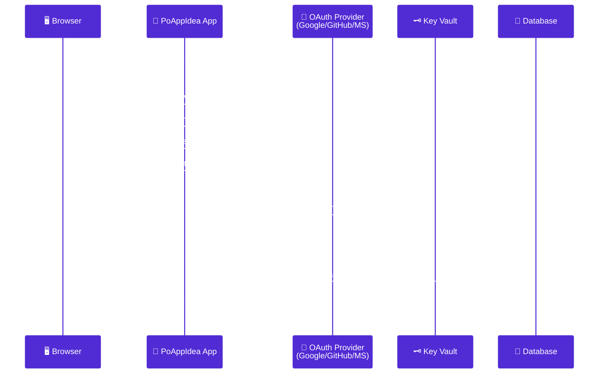
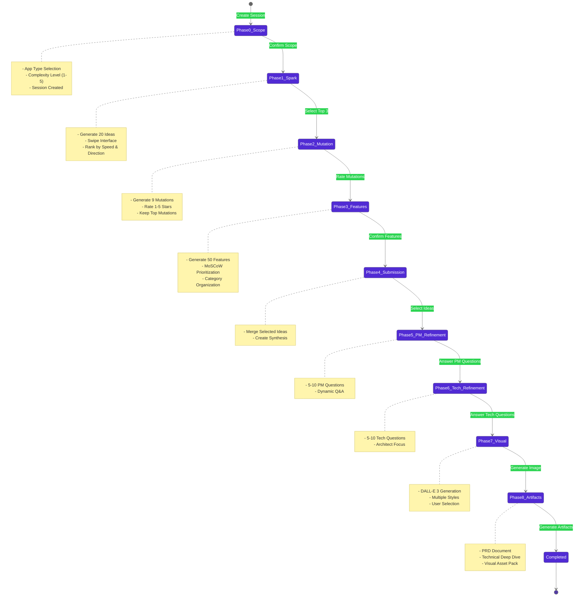
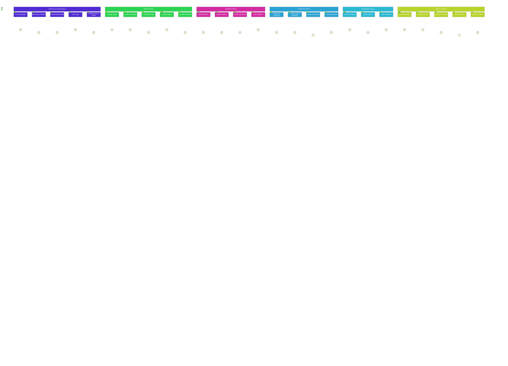
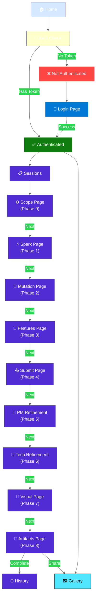
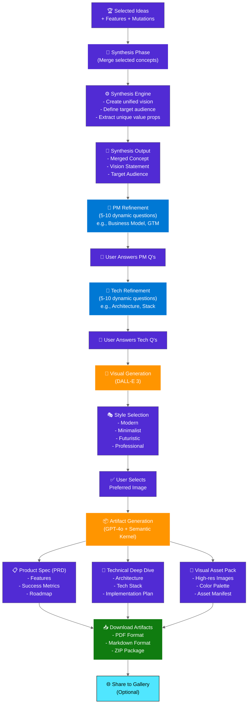
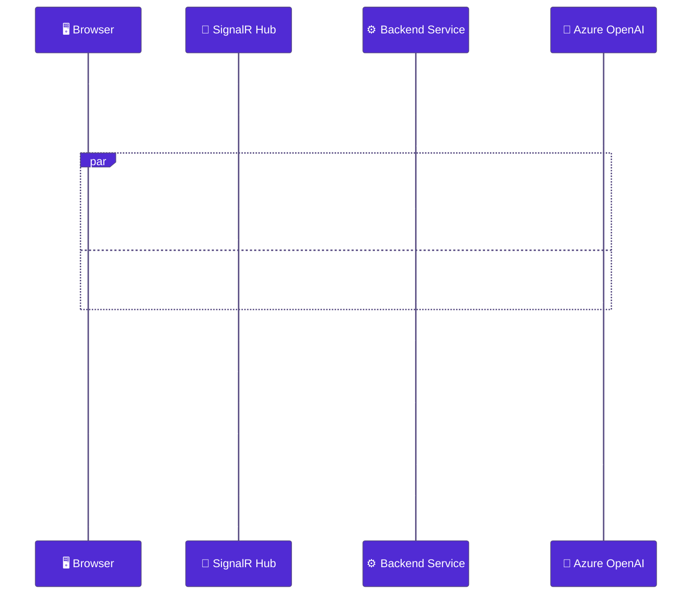
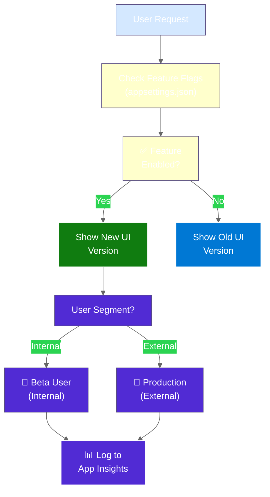
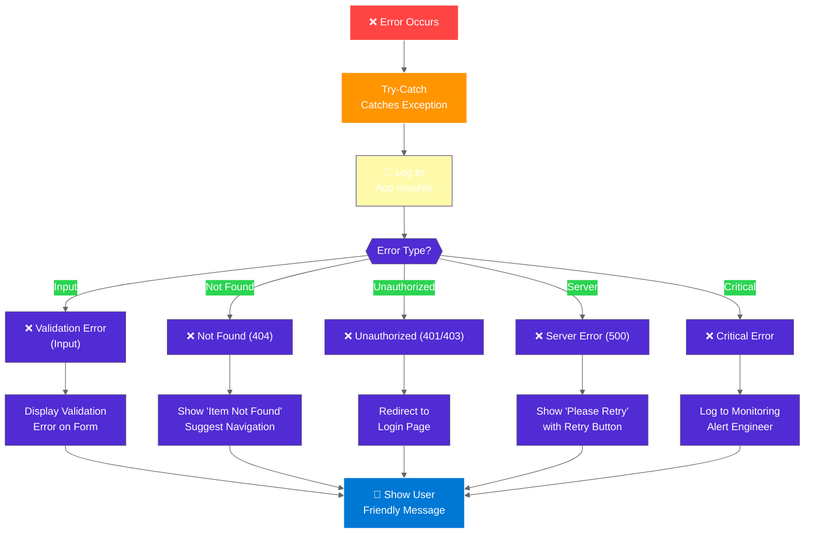

# PoAppIdea Application Flow

> **Version:** 2.0 (Enhanced)  
> **Last Updated:** 2026-02-12  
> **Audience:** Frontend developers, product managers, QA

---

## 🔐 Authentication Flow

### Multi-Provider OAuth 2.0 Implementation

---

## 📋 Session Lifecycle

### From Creation to Completion

---

## 👥 User Journey Map

### Complete User Experience Flow

---

## 🎯 Page State Machine

### Navigation & Page Transitions

---

## 🧬 Idea Generation & Mutation Pipeline

### AI-Powered Concept Evolution

```mermaid
%%{init: {'theme': 'base', 'themeVariables': { 'primaryColor': '#512BD4', 'primaryTextColor': '#fff', 'lineColor': '#666'}}}%%
graph TB
    Start["👤 User Input<br/>AppType + Complexity"]
    
    Spark["⚡ Spark Phase<br/>Generate 20 Ideas<br/>(GPT-4o)"]
    SwipeInterface["🎨 Swipe Interface<br/>(Tinder-style)"]
    SparkRate["📊 Ranking<br/>(Speed + Direction)"]
    SelectTop3["🏆 Select Top 3<br/>User Favorites"]
    
    Mutation["🧬 Mutation Phase<br/>Generate 9 Mutations<br/>(From Top 3)"]
    MutationTypes["📝 Mutation Types<br/>- Recombine<br/>- Enhance<br/>- Simplify"]
    RateMutations["⭐ Rate Mutations<br/>(1-5 Stars)"]
    SelectMutations["🎯 Keep Top Rated"]
    
    Features["🎯 Feature Expansion<br/>Generate 50 Features<br/>(From Selections)"]
    MoSCoW["📋 MoSCoW Priority<br/>- Must Have<br/>- Should Have<br/>- Could Have<br/>- Won't Have"]
    Categories["🗂️ Categorize<br/>(UI, Backend, etc)"]
    SelectFeatures["✅ Confirm Features"]

    Start --> Spark
    Spark --> SwipeInterface
    SwipeInterface --> SparkRate
    SparkRate --> SelectTop3
    SelectTop3 --> Mutation
    
    Mutation --> MutationTypes
    MutationTypes --> RateMutations
    RateMutations --> SelectMutations
    SelectMutations --> Features
    
    Features --> MoSCoW
    MoSCoW --> Categories
    Categories --> SelectFeatures
    
    SelectFeatures --> End["📤 Submit for Synthesis"]

    style Spark fill:#ff9500,stroke:#fff,color:#fff
    style SwipeInterface fill:#0078D4,stroke:#fff,color:#fff
    style Mutation fill:#ff9500,stroke:#fff,color:#fff
    style Features fill:#ff9500,stroke:#fff,color:#fff
    style SelectTop3 fill:#107c10,stroke:#fff,color:#fff
    style SelectMutations fill:#107c10,stroke:#fff,color:#fff
    style SelectFeatures fill:#107c10,stroke:#fff,color:#fff
    style End fill:#512BD4,stroke:#fff,color:#fff
```

---

## 💡 Synthesis & Refinement Flow

### From Selection to Final Document

---

## 🔄 SignalR Real-Time Updates

### How the App Stays Responsive During Long Operations

---

## 🎛️ Feature Flags & Experimentation

### Enabling Features, A/B Testing, Feature Gates

---

## 🚨 Error Handling & Recovery

### Graceful Error Management

