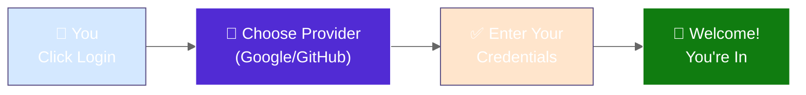
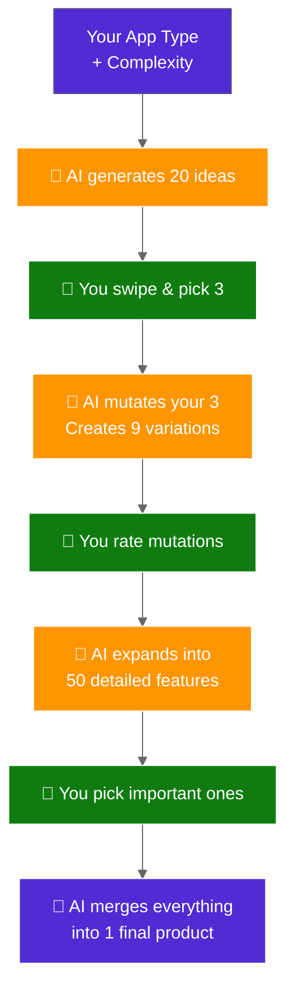
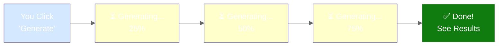
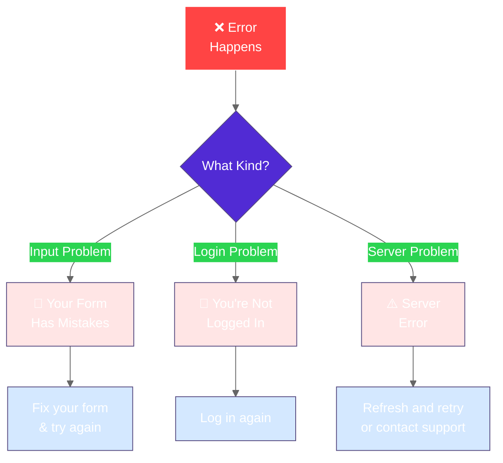

# PoAppIdea Application Flow (Simplified)

> **Version:** 1.0 (Simplified for Quick Reference)  
> **Last Updated:** 2026-02-12  
> **Audience:** New developers, QA, stakeholders

---

## 🔐 How Login Works

---

## 📋 The 7-Phase Journey

```mermaid
%%{init: {'theme': 'base', 'themeVariables': { 'primaryColor': '#512BD4', 'primaryTextColor': '#fff', 'lineColor': '#666'}}}%%
graph LR
    A["⚙️ Setup<br/>Choose app type<br/>& complexity"]
    B["⚡ Swipe<br/>Rate 20 ideas<br/>Pick top 3"]
    C["🧬 Evolve<br/>Rate 9 mutations<br/>Keep best"]
    D["🎯 Features<br/>Pick important<br/>features"]
    E["💬 Refine<br/>Answer questions<br/>about your idea"]
    F["🎨 Image<br/>AI creates<br/>visual"]
    G["📄 Download<br/>Get PRD + Docs<br/>+ Images"]

    A --> B --> C --> D --> E --> F --> G

    style A fill:#ffe5cc
    style B fill:#ff9500,stroke:#fff,color:#fff
    style C fill:#ff9500,stroke:#fff,color:#fff
    style D fill:#0078D4,stroke:#fff,color:#fff
    style E fill:#0078D4,stroke:#fff,color:#fff
    style F fill:#ff9500,stroke:#fff,color:#fff
    style G fill:#107c10,stroke:#fff,color:#fff
```

---

## 🎯 What Happens in Each Phase

| Phase | What You Do | How Many? | Outcome |
|-------|-----------|----------|---------|
| ⚙️ **Setup** | Tell us your app type | 1 choice | Session starts |
| ⚡ **Spark** | Swipe on AI ideas | 20 ideas | Pick top 3 |
| 🧬 **Evolve** | Rate AI mutations | 9 concepts | Keep best ones |
| 🎯 **Features** | Choose key features | 50 features | Organize into buckets |
| 💬 **Refine** | Answer about your idea | 10 questions | AI understands your vision |
| 🎨 **Image** | Pick image style | 4 options | Visual representation |
| 📄 **Download** | Get your documents | 3 formats | PRD, Docs, Web pack |

---

## 🧬 Idea Evolution (Simplified)

### How AI Helps Your Ideas Grow

---

## 📊 Real-Time Updates

### Live Progress as AI Works

**You don't wait in the dark—you see updates as AI works!**

---

## 💥 What If Something Goes Wrong?

**Built-in error handling means you get helpful messages, not cryptic errors.**

