# PoAppIdea System Architecture

> **Version:** 2.0 (Enhanced)  
> **Last Updated:** 2026-02-12  
> **Audience:** Architects, DevOps, Full-Stack Developers

---

## 📐 C4 Context Diagram (Level 1)

### System Context - "Where It Lives"

```mermaid
%%{init: {'theme': 'base', 'themeVariables': { 'primaryColor': '#512BD4', 'primaryTextColor': '#fff', 'primaryBorderColor': '#512BD4', 'lineColor': '#666', 'secondaryColor': '#0078D4', 'tertiaryColor': '#f3f3f3'}}}%%
graph TB
    User["👤 Product Creator<br/>(User)"]
    PoAppIdea["🚀 PoAppIdea Platform<br/>(Azure App Service)"]
    OAuth["🔐 OAuth Providers<br/>(Google, GitHub, Microsoft)"]
    AI["🤖 Azure OpenAI<br/>(GPT-4o, DALL-E 3)"]
    Storage["💾 Azure Storage<br/>(Tables, Blobs)"]
    Analytics["📊 Application Insights<br/>(Telemetry)"]
    Gallery["🎨 Public Gallery<br/>(Community Ideas)"]

    User -->|"Browse, Create, Refine"| PoAppIdea
    PoAppIdea -->|"Authenticate"| OAuth
    PoAppIdea -->|"Generate Ideas, Images"| AI
    PoAppIdea -->|"Persist Data"| Storage
    PoAppIdea -->|"Send Telemetry"| Analytics
    PoAppIdea -->|"Share, Discover"| Gallery

    style User fill:#d4e8ff
    style PoAppIdea fill:#512BD4,stroke:#fff,color:#fff
    style OAuth fill:#0078D4,stroke:#fff,color:#fff
    style AI fill:#ff9500,stroke:#fff,color:#fff
    style Storage fill:#5ba3d0,stroke:#fff,color:#fff
    style Analytics fill:#107c10,stroke:#fff,color:#fff
    style Gallery fill:#50e6ff,stroke:#000,color:#000
```

---

## 🏗️ Container Diagram (Level 2)

### System Components & Their Interactions

---

## 🔄 Data Flow Diagram

### How Data Moves Through the System

```mermaid
%%{init: {'theme': 'base', 'themeVariables': { 'primaryColor': '#512BD4', 'primaryTextColor': '#fff', 'lineColor': '#666'}}}%%
flowchart LR
    User["👤 User Input"]
    Session["📋 Create Session"]
    Generate["🤖 AI Generation"]
    Store["💾 Persist Data"]
    Present["🎨 Display Results"]
    Download["📥 Export Artifacts"]

    User -->|"App scope, complexity"| Session
    Session -->|"Session ID"| Generate
    Generate -->|"20 Ideas, mutations, features"| Store
    Store -->|"Table Storage + Blob Storage"| Present
    Present -->|"Blazor Components"| User
    Present -->|"Download PRD, Tech Docs"| Download

    style User fill:#d4e8ff
    style Session fill:#512BD4,stroke:#fff,color:#fff
    style Generate fill:#ff9500,stroke:#fff,color:#fff
    style Store fill:#ffffcc
    style Present fill:#0078D4,stroke:#fff,color:#fff
    style Download fill:#107c10,stroke:#fff,color:#fff
```

---

## 🔌 API Gateway & Security

### Authentication & Rate Limiting Flow

```mermaid
%%{init: {'theme': 'base', 'themeVariables': { 'primaryColor': '#512BD4', 'primaryTextColor': '#fff', 'lineColor': '#666'}}}%%
flowchart TD
    Request["Incoming Request"]
    RateLimit["Rate Limiter<br/>(100 req/min)"]
    Auth["Authentication<br/>(OAuth 2.0)"]
    JWT["JWT Validation"]
    Authorized["✅ Authorized?"]
    API["Route to API"]
    Error["❌ Error Response"]

    Request --> RateLimit
    RateLimit -->|"Pass"| Auth
    RateLimit -->|"Exceed"| Error
    Auth -->|"Token Provider"| JWT
    JWT --> Authorized
    Authorized -->|"Valid"| API
    Authorized -->|"Invalid"| Error

    style Request fill:#d4e8ff
    style RateLimit fill:#ffe5cc
    style Auth fill:#ffe5e5
    style JWT fill:#ffe5e5
    style Authorized fill:#ffffcc
    style API fill:#512BD4,stroke:#fff,color:#fff
    style Error fill:#ff4444,stroke:#fff,color:#fff
```

---

## 📊 Infrastructure Topology

### Deployment Architecture on Azure

```mermaid
%%{init: {'theme': 'base', 'themeVariables': { 'primaryColor': '#512BD4', 'primaryTextColor': '#fff', 'lineColor': '#666'}}}%%
graph TB
    Internet["🌐 Internet"]
    CDN["Azure CDN<br/>(Static Assets)"]
    AppGateway["App Gateway<br/>(SSL/TLS)"]
    
    subgraph AppService["App Service"]
        direction TB
        Container["Docker Container<br/>(.NET 10)"]
    end

    subgraph ResourceGroup["Resource Group: rg-PoAppIdea-prod"]
        direction TB
        AppService
        Storage["Storage Account<br/>(Hot tier)"]
        Tables["Table Storage"]
        Blobs["Blob Storage"]
        OpenAI["Azure OpenAI"]
        KeyVault["Key Vault"]
        Analytics["App Insights"]
    end

    Internet -->|"requests"| CDN
    CDN -->|"pass-through"| AppGateway
    AppGateway -->|"HTTPS/443"| Container
    Container -->|"Read/Write"| Tables
    Container -->|"Store Assets"| Blobs
    Container -->|"AI requests"| OpenAI
    Container -->|"Get secrets"| KeyVault
    Container -->|"Telemetry"| Analytics

    style Internet fill:#d4e8ff
    style CDN fill:#0078D4,stroke:#fff,color:#fff
    style AppGateway fill:#0078D4,stroke:#fff,color:#fff
    style Container fill:#512BD4,stroke:#fff,color:#fff
    style Storage fill:#5ba3d0,stroke:#fff,color:#fff
    style Tables fill:#5ba3d0,stroke:#fff,color:#fff
    style Blobs fill:#5ba3d0,stroke:#fff,color:#fff
    style OpenAI fill:#ff9500,stroke:#fff,color:#fff
    style KeyVault fill:#ffe5e5
    style Analytics fill:#107c10,stroke:#fff,color:#fff
```

---

## 🚀 Technical Stack

### Platform & Dependencies

| Layer | Component | Technology | Purpose |
|-------|-----------|-----------|---------|
| **Frontend** | UI Framework | Blazor Server (.NET 10) | Rich, interactive web UI |
| **Frontend** | Real-time | SignalR | Live updates & notifications |
| **Frontend** | Components | Radzen | Pre-built, styled components |
| **API** | Framework | Minimal APIs | Lightweight REST endpoints |
| **Business** | Orchestration | Semantic Kernel | AI prompt orchestration |
| **AI** | LLM | Azure OpenAI GPT-4o | Text generation & reasoning |
| **AI** | Image Gen | Azure OpenAI DALL-E 3 | Visual asset generation |
| **Data** | Tables | Azure Table Storage | Relational NoSQL data |
| **Data** | Blobs | Azure Blob Storage | File storage & CDN |
| **Auth** | OAuth | Google, GitHub, Microsoft | Multi-provider authentication |
| **Security** | Secrets | Azure Key Vault | Credential management |
| **Monitoring** | APM | Application Insights | Logs, metrics, traces |
| **Testing** | E2E | Playwright (TypeScript) | Browser automation tests |
| **Testing** | Integration | Testcontainers | Docker-based test data |
| **Testing** | Unit | xUnit | .NET unit tests |

---

## 🔐 Security Architecture

### Multi-Layer Security Design

```mermaid
%%{init: {'theme': 'base', 'themeVariables': { 'primaryColor': '#ffe5e5', 'primaryTextColor': '#000', 'lineColor': '#ff4444'}}}%%
graph TB
    subgraph Layer1["🌐 Network Layer"]
        TLS["TLS 1.3<br/>(HTTPS/443)"]
        RateLimit["Rate Limiting<br/>(100 req/min)"]
    end

    subgraph Layer2["🔑 Identity Layer"]
        OAuth["OAuth 2.0<br/>(Social Login)"]
        JWT["JWT Tokens<br/>(Signed)"]
    end

    subgraph Layer3["🛡️ Application Layer"]
        AuthPolicy["Authorization Policy<br/>(Require Auth)"]
        Validation["Input Validation<br/>(FluentValidation)"]
    end

    subgraph Layer4["🔒 Data Layer"]
        Encryption["Data Encryption<br/>(at rest & in transit)"]
    end

    subgraph Layer5["🗝️ Secret Layer"]
        KeyVault["Azure Key Vault<br/>(Managed Identity)"]
    end

    TLS --> RateLimit
    RateLimit --> OAuth
    OAuth --> JWT
    JWT --> AuthPolicy
    AuthPolicy --> Validation
    Validation --> Encryption
    Encryption --> KeyVault

    style Layer1 fill:#e5f3ff
    style Layer2 fill:#e5e5ff
    style Layer3 fill:#ffe5e5
    style Layer4 fill:#e5ffe5
    style Layer5 fill:#fff5e5
```

---

## 📈 Scalability Considerations

### Performance & Load Handling

| Feature | Implementation | Capacity |
|---------|---------------|----------|
| **Compression** | Brotli + Gzip | 60-80% size reduction |
| **Caching** | Response caching headers | Static assets cached by CDN |
| **Async Processing** | SignalR for long operations | Non-blocking AI calls |
| **Connection Pooling** | Table & Blob clients | Reduces latency |
| **Rate Limiting** | Per-user throttling | 100 requests/minute |
| **Auto-scaling** | App Service scale-out | Handles traffic spikes |
| **Monitoring** | Application Insights | Real-time health monitoring |

---

## 🔍 Key Architectural Decisions

### Why This Architecture?

| Decision | Rationale | Trade-offs |
|----------|-----------|-----------|
| **Blazor Server** | Real-time UI, C# codebehind | Server affinity required |
| **Table Storage** | Cost-effective NoSQL, CRUD simple | Limited query complexity |
| **Semantic Kernel** | Multi-AI orchestration, flexible prompts | Additional abstraction layer |
| **Managed Identity** | Secure secret access, no key rotation | Azure-only solution |
| **SignalR** | Real-time notifications, stateful | Memory overhead for connections |

