# PoAppIdea System Architecture (Simplified)

> **Version:** 1.0 (Simplified for Quick Reference)  
> **Last Updated:** 2026-02-12  
> **Audience:** New developers, product managers

---

## 🎯 What Is PoAppIdea?

A cloud-hosted Blazor web app that uses AI to help users brainstorm product ideas through interactive swiping, evolution, and document generation.

---

## 🏗️ Basic Structure

```mermaid
%%{init: {'theme': 'base', 'themeVariables': { 'primaryColor': '#512BD4', 'primaryTextColor': '#fff', 'lineColor': '#666'}}}%%
graph LR
    Browser["🖥️ Your Browser"]
    App["🚀 PoAppIdea<br/>Web App"]
    AI["🤖 AI Engine"]
    Database["💾 Database"]

    Browser -->|"Click, Swipe"| App
    App -->|"Generate Ideas"| AI
    App -->|"Save Progress"| Database
    Database -->|"Load Progress"| App
    App -->|"Show Results"| Browser

    style Browser fill:#d4e8ff
    style App fill:#512BD4,stroke:#fff,color:#fff
    style AI fill:#ff9500,stroke:#fff,color:#fff
    style Database fill:#ffffcc
```



---

## 📍 Where It Runs

- **Frontend:** Your web browser (Chrome, Edge, Safari, Firefox)
- **Backend:** Microsoft Azure cloud (App Service in US East)
- **Storage:** Azure cloud database
- **AI:** Azure OpenAI (GPT-4o for text, DALL-E 3 for images)

---

## 🔐 How You Log In

```mermaid
%%{init: {'theme': 'base', 'themeVariables': { 'primaryColor': '#512BD4', 'primaryTextColor': '#fff', 'lineColor': '#666'}}}%%
flowchart LR
    A["👤 Click Login"]
    B["🔑 Choose Provider<br/>(Google/GitHub/Microsoft)"]
    C["✅ Authenticate"]
    D["🚀 Enter App"]

    A --> B --> C --> D

    style A fill:#d4e8ff
    style B fill:#512BD4,stroke:#fff,color:#fff
    style C fill:#107c10,stroke:#fff,color:#fff
    style D fill:#0078D4,stroke:#fff,color:#fff
```



---

## 📊 Main Components

| Component | What It Does | Built With |
|-----------|-------------|-----------|
| **Web App** | Displays pages and handles clicks | Blazor Server (.NET) |
| **AI Engine** | Generates ideas, images, documents | GPT-4o + DALL-E 3 |
| **Database** | Stores your sessions and ideas | Azure Table Storage |
| **File Storage** | Keeps your downloaded files | Azure Blob Storage |

---

## 🔄 Typical User Journey


---

## 🛡️ How Data Stays Safe

1. **Login Security:** You log in via Google/GitHub/Microsoft (trusted providers)
2. **Encrypted Connection:** Data travels over HTTPS (padlocked connection)
3. **Secure Storage:** Secrets kept in Azure Key Vault (encrypted vault)
4. **Permission Checks:** Only you can see your sessions and ideas

---

## 🚀 Technology Stack (Easy Version)

- **Language:** C# (.NET)
- **Frontend Framework:** Blazor (interactive web pages)
- **Real-time Updates:** SignalR (instant notifications)
- **AI:** Azure OpenAI (smart text & images)
- **Database:** Azure Table Storage (cloud database)
- **Cloud Provider:** Microsoft Azure

---

## 📂 File Organization

```
PoAppIdea/
├── src/                          # Source code
│   ├── PoAppIdea.Web/           # Main web app
│   ├── PoAppIdea.Core/          # Business logic
│   └── PoAppIdea.Shared/        # Shared types
├── tests/                        # Tests
│   ├── PoAppIdea.E2E/           # Browser tests
│   ├── PoAppIdea.IntegrationTests/
│   └── PoAppIdea.UnitTests/
├── docs/                         # Documentation
└── infra/                        # Cloud setup files
```

---

## ⚡ Quick Summary

1. **User goes to website** → Browser loads the app
2. **User logs in** → OAuth provider verifies identity
3. **User creates session** → AI generates ideas
4. **User swipes & rates** → Chooses favorites
5. **AI synthesizes** → Combines selections
6. **AI generates image** → Creates visual
7. **Output generated** → PRD, Tech Docs, Images
8. **User downloads** → Gets all files

**That's it!** The AI does the hard work, you just click what you like.

