# PoAppIdea Component Map

> **Version:** 2.0 (Enhanced)  
> **Last Updated:** 2026-02-12  
> **Audience:** Frontend developers, architects

---

## 🏗️ Component Hierarchy

### Complete Component Tree

```mermaid
%%{init: {'theme': 'base', 'themeVariables': { 'primaryColor': '#512BD4', 'primaryTextColor': '#fff', 'lineColor': '#666'}}}%%
graph TB
    subgraph App["🖥️ Application Shell"]
        direction TB
        AppComponent["App.razor<br/>(Root Component)"]
        Routes["Routes.razor<br/>(Route Definitions)"]
        MainLayout["MainLayout.razor<br/>(Global Layout)"]
        NavMenu["NavMenu.razor<br/>(Navigation)"]
    end

    subgraph Pages["📄 Pages (14 Total)"]
        direction TB
        Home["🏠 Home.razor"]
        Login["🔐 Login.razor"]
        Scope["⚙️ ScopePage.razor"]
        Spark["⚡ SparkPage.razor"]
        Mutation["🧬 MutationPage.razor"]
        Feature["🎯 FeatureExpansionPage.razor"]
        Submit["📤 SubmissionPage.razor"]
        PMRefine["💬 RefinementPage.razor"]
        TechRefine["🔧 TechPage.razor"]
        Visual["🎨 VisualPage.razor"]
        Artifacts["📄 ArtifactsPage.razor"]
        Sessions["📋 SessionsPage.razor"]
        Gallery["🖼️ GalleryPage.razor"]
        History["⏰ UserHistoryPage.razor"]
    end

    subgraph Shared["🔄 Shared Components"]
        direction TB
        SwipeCard["SwipeCard.razor<br/>(Tinder-style)"]
        MutationCard["MutationCard.razor<br/>(Rate mutations)"]
        FeatureCard["FeatureCard.razor<br/>(Feature items)"]
        GalleryCard["GalleryCard.razor<br/>(Session preview)"]
        ArtifactViewer["ArtifactViewer.razor<br/>(PDF/Markdown view)"]
        SynthesisPreview["SynthesisPreview.razor<br/>(Show synthesis)"]
        QuestionCard["QuestionCard.razor<br/>(Q&A interface)"]
        PreferenceChart["PreferenceChart.razor<br/>(Visualization)"]
        SessionProgress["SessionProgress.razor<br/>(Progress bar)"]
        Breadcrumb["SessionBreadcrumb.razor<br/>(Navigation)"]
        Loader["SkeletonLoader.razor<br/>(Loading state)"]
    end

    subgraph Services["⚙️ Feature Services"]
        direction TB
        SessionSvc["SessionService<br/>(Manage sessions)"]
        SparkSvc["SparkService<br/>(Generate ideas)"]
        MutationSvc["MutationService<br/>(Evolve ideas)"]
        FeatureSvc["FeatureExpansionService<br/>(Expand features)"]
        SynthesisSvc["SynthesisService<br/>(Merge concepts)"]
        RefinementSvc["RefinementService<br/>(Q&A engine)"]
        VisualSvc["VisualService<br/>(Generate images)"]
        ArtifactSvc["ArtifactService<br/>(Create documents)"]
        GallerySvc["GalleryService<br/>(Browse ideas)"]
        PersonalitySvc["PersonalityService<br/>(Brand settings)"]
    end

    subgraph Repositories["💾 Data Access"]
        direction TB
        SessionRepo["ISessionRepository"]
        IdeaRepo["IIdeaRepository"]
        SwipeRepo["ISwipeRepository"]
        MutationRepo["IMutationRepository"]
        FeatureRepo["IFeatureVariationRepository"]
        SynthesiRepo["ISynthesisRepository"]
        RefinementRepo["IRefinementAnswerRepository"]
        VisualRepo["IVisualAssetRepository"]
        ArtifactRepo["IArtifactRepository"]
        PersonalityRepo["IPersonalityRepository"]
    end

    subgraph Storage["💾 Storage Clients"]
        direction TB
        TableClient["Azure TableClient<br/>(Relational data)"]
        BlobClient["Azure BlobClient<br/>(Files & assets)"]
    end

    subgraph AI["🤖 AI Infrastructure"]
        direction TB
        Kernel["Semantic Kernel<br/>(Orchestration)"]
        ChatSvc["IChatCompletionService<br/>(GPT-4o)"]
        GPT4o["Azure OpenAI<br/>GPT-4o Model"]
        Dalle["Azure OpenAI<br/>DALL-E 3 Model"]
    end

    subgraph Auth["🔐 Authentication"]
        direction TB
        AuthHandler["OAuthAuthenticationHandler<br/>(OAuth 2.0)"]
        GoogleAuth["Google OAuth"]
        GitHubAuth["GitHub OAuth"]
        MicrosoftAuth["Microsoft OAuth"]
    end

    subgraph Infrastructure["🏗️ Infrastructure"]
        direction TB
        HealthCheck["Health Check Service<br/>(/health endpoint)"]
        Telemetry["Telemetry Service<br/>(App Insights)"]
        KeyVault["Azure Key Vault<br/>(Secrets)"]
    end

    AppComponent --> Routes
    Routes --> Pages
    AppComponent --> MainLayout
    MainLayout --> NavMenu
    MainLayout --> Shared

    Pages --> Services
    Shared --> Services

    Services --> Repositories
    Repositories --> Storage

    Services --> AI
    Services --> Auth
    Services --> Infrastructure

    Kernel --> ChatSvc
    ChatSvc --> GPT4o
    Kernel --> Dalle

    AuthHandler --> GoogleAuth
    AuthHandler --> GitHubAuth
    AuthHandler --> MicrosoftAuth

    style App fill:#512BD4,stroke:#fff,color:#fff
    style Pages fill:#0078D4,stroke:#fff,color:#fff
    style Shared fill:#0078D4,stroke:#fff,color:#fff
    style Services fill:#cce5ff
    style Repositories fill:#ffffcc
    style Storage fill:#ffffcc
    style AI fill:#ffe5cc
    style Auth fill:#ffe5e5
    style Infrastructure fill:#e5ffe5
```

---

## 📊 Service Dependencies

### How Services Interact

---

## 🔌 External Integrations

### API Calls & Third-Party Services

---

## 🎯 Component Responsibilities

### What Each Component Does

| Component Type | Examples | Responsibility |
|---|---|---|
| **Pages** | SparkPage, VisualPage | Handle routing, display phase-specific UI |
| **Shared Components** | SwipeCard, QuestionCard | Reusable UI building blocks |
| **Services** | SparkService, VisualService | Business logic, orchestration |
| **Repositories** | IIdeaRepository, ISwipeRepository | Data access & persistence |
| **AI Services** | IChatCompletionService | LLM integration via Semantic Kernel |
| **Auth** | OAuthAuthenticationHandler | OAuth 2.0 flow & JWT handling |

---

## 🔄 Data Flow: A Complete Example

### How a Swipe Gets Processed

```mermaid
%%{init: {'theme': 'base', 'themeVariables': { 'primaryColor': '#512BD4', 'primaryTextColor': '#fff', 'lineColor': '#666'}}}%%
sequenceDiagram
    participant UI as 🖥️ SwipeCard<br/>Component
    participant Service as ⚙️ SparkService
    participant Repo as 💾 ISwipeRepository
    participant Storage as ☁️ Azure Table<br/>Storage

    UI->>Service: OnSwipe(ideaId, direction, speed)
    Service->>Service: Calculate Score<br/>(direction × speed)
    Service->>Repo: SaveSwipe(swipeData)
    Repo->>Storage: Insert Row
    Storage->>Repo: ✅ Saved
    Repo->>Repo: Update In-Memory<br/>Rankings
    Service->>UI: Return Score
    UI->>UI: Update UI<br/>Show Next Card
```

---

## 🚀 Performance Optimizations

### How Components Stay Fast

| Optimization | Where | Benefit |
|---|---|---|
| **Lazy Loading** | Pages loaded on-demand | Faster initial load |
| **Caching** | Service-level caching | Avoid re-fetching |
| **Compression** | Brotli/Gzip | 60-80% smaller payloads |
| **Async/Await** | All AI calls | Non-blocking UI |
| **Virtual Scrolling** | Large lists | Handle 100s of items |
| **SignalR** | Real-time updates | No polling needed |

