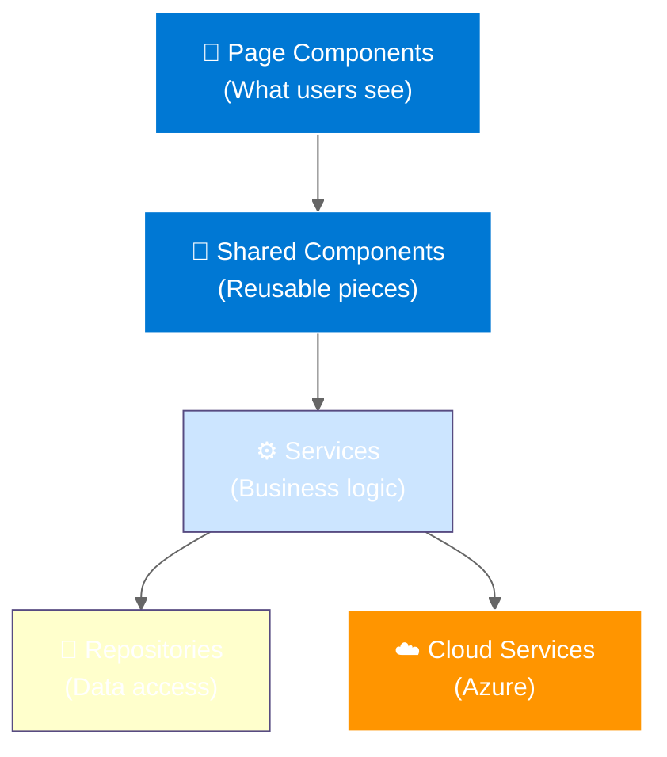
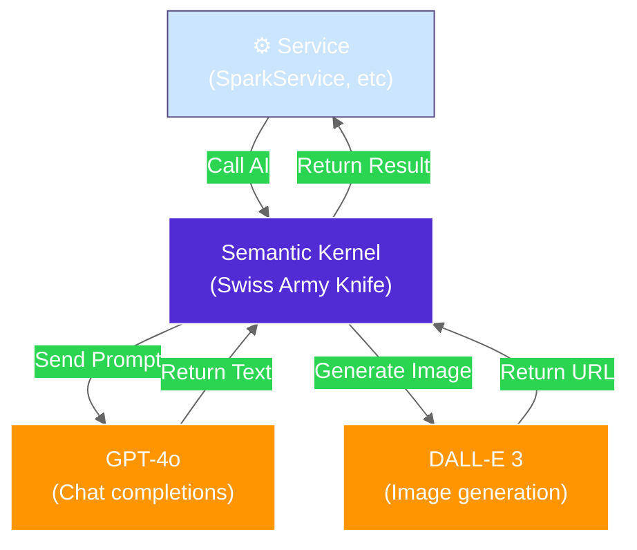
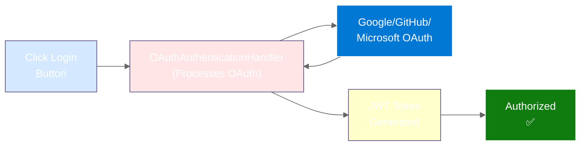

# PoAppIdea Component Map (Simplified)

> **Version:** 1.0 (Simplified for Quick Reference)  
> **Last Updated:** 2026-02-12  
> **Audience:** Frontend developers, new team members

---

## 🏗️ Big Picture: What Code Lives Where



---

## 📄 Pages (14 Total)

### What Each Page Does

| Page | Route | Purpose |
|------|-------|---------|
| **Home** | `/` | Landing page |
| **Login** | `/login` | Authentication |
| **Scope** | `/scope` | Phase 0: Choose app type |
| **Spark** | `/spark` | Phase 1: Swipe ideas |
| **Mutation** | `/mutation` | Phase 2: Rate mutations |
| **Features** | `/features` | Phase 3: Select features |
| **Submit** | `/submit` | Phase 4: Merge ideas |
| **Refinement** | `/refine` | Phase 5: Answer questions |
| **Visual** | `/visual` | Phase 6: Pick image style |
| **Artifacts** | `/artifacts` | Phase 7: Download documents |
| **Sessions** | `/sessions` | List your sessions |
| **Gallery** | `/gallery` | Browse community ideas |
| **History** | `/history` | Your past sessions |
| **Personality** | `/personality` | Brand settings |

---

## 🔄 Shared Components

### Reusable Building Blocks

```
Reusable Components:
├── SwipeCard.razor        — Tinder-style card
├── MutationCard.razor     — Mutation display
├── FeatureCard.razor      — Feature list item
├── QuestionCard.razor     — Q&A interface
├── ArtifactViewer.razor   — PDF/Markdown viewer
├── SessionProgress.razor  — Progress bar
└── SkeletonLoader.razor   — Loading skeleton
```

**These appear on multiple pages.**

---

## ⚙️ Services (10 Total)

### Where the Work Happens

| Service | What It Does | Input | Output |
|---------|-------------|-------|--------|
| **SessionService** | Manage sessions | User ID | Session object |
| **SparkService** | Generate ideas | Session scope | 20 ideas |
| **MutationService** | Evolve ideas | Top 3 ideas | 9 mutations |
| **FeatureExpansionService** | Expand features | Concept | 50 features |
| **SynthesisService** | Merge selections | User picks | 1 unified concept |
| **RefinementService** | Q&A logic | Concept | Questions & answers |
| **VisualService** | Image generation | Concept + style | Image URL |
| **ArtifactService** | Document generation | All session data | PDF, Markdown |
| **GalleryService** | Share & discover | Session | Public listing |
| **PersonalityService** | Brand settings | User prefs | Brand profile |

---

## 💾 Repositories

### Data Access Layer

```
Repositories = "Bridge between Services and Database"

Each entity has a repository:
  ISessionRepository         → Manage sessions
  IIdeaRepository            → Manage ideas
  ISwipeRepository           → Manage swipes
  IMutationRepository        → Manage mutations
  IFeatureVariationRepository → Manage features
  ISynthesisRepository       → Manage synthesis
  IRefinementAnswerRepository → Manage Q&A
  IVisualAssetRepository     → Manage images
  IArtifactRepository        → Manage documents
```

**All repositories use Azure Table Storage under the hood.**

---

## 🤖 AI Integration

### How AI Gets Called



---

## 🔐 Authentication Flow

### How Login Works



---

## 🔗 How It All Connects

### User Interaction Flow Example

**User swipes on an idea:**

```
1. SwipeCard.razor (displays the card)
   ↓ user clicks left/right
2. SparkService.RecordSwipe() (business logic)
   ↓ calculate swipe score
3. ISwipeRepository.SaveSwipe() (data access)
   ↓ insert into database
4. Azure Table Storage (persists)
   ↓ data saved
5. SignalR updates UI (real-time)
   ↓ ranking updated instantly
6. User sees next card
```

---

## 📊 Performance Features

### Making It Fast

| Feature | Benefit |
|---------|---------|
| **Async/Await** | Responsive UI while AI works |
| **SignalR** | Real-time updates, no polling |
| **Caching** | Avoid re-fetching data |
| **Compression** | Smaller downloads (Brotli) |
| **Lazy Loading** | Load pages only when needed |

---

## 🧩 File Organization

```
src/PoAppIdea.Web/
├── Components/
│   ├── Pages/              (14 page components)
│   └── Shared/             (11 reusable components)
├── Features/               (10 service folders)
│   ├── Spark/
│   ├── Mutation/
│   ├── Refinement/
│   └── ... etc
├── Infrastructure/
│   ├── AI/                 (AI integration)
│   ├── Auth/               (OAuth handlers)
│   ├── Storage/            (Repositories)
│   ├── Health/             (Health checks)
│   └── Telemetry/          (Logging)
└── Program.cs              (Configuration)
```

