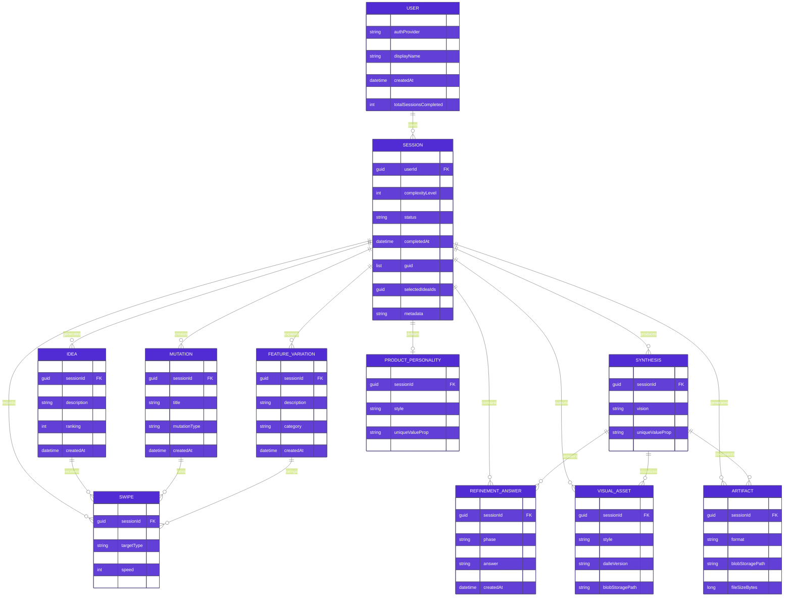

# PoAppIdea Data Model

> **Version:** 2.0 (Enhanced)  
> **Last Updated:** 2026-02-12  
> **Audience:** Backend developers, data architects

---

## 📊 Entity Relationship Diagram (ERD)

### Complete Data Model



---

## 🔄 Session State Machine

### Session Lifecycle & Status Transitions


---

## 📝 Data Storage Schema

### How Data Maps to Azure Table Storage


---

## 💾 Data Types & Properties

### Core Entity Definitions

#### USER
| Property | Type | Notes |
|----------|------|-------|
| `id` | string | UUID from OAuth provider |
| `authProvider` | string | 'google', 'github', 'microsoft' |
| `email` | string | Unique identifier |
| `displayName` | string | User-friendly name |
| `avatarUrl` | string | OAuth provider avatar |
| `createdAt` | datetime | Account creation |
| `lastLoginAt` | datetime | Latest session login |
| `totalSessionsCompleted` | int | Metric: completed count |

#### SESSION
| Property | Type | Notes |
|----------|------|-------|
| `id` | GUID | Unique session identifier |
| `userId` | GUID | Reference to USER |
| `appType` | string | 'Web', 'Mobile', 'Desktop', 'API', 'SaaS' |
| `complexityLevel` | int | 1-5 scale |
| `currentPhase` | string | See phase list below |
| `status` | string | 'Created', 'InProgress', 'Paused', 'Completed', 'Abandoned' |
| `createdAt` | datetime | Session start |
| `completedAt` | datetime? | Null if incomplete |
| `topIdeaIds` | list[GUID] | Phase 1: Top 3 ideas |
| `selectedIdeaIds` | list[GUID] | Phase 4: Selected for synthesis |
| `synthesisId` | GUID | Reference to SYNTHESIS |
| `metadata` | JSON | Extra session-specific data |

#### IDEA
| Property | Type | Notes |
|----------|------|-------|
| `id` | GUID | Unique idea ID |
| `sessionId` | GUID | Reference to SESSION |
| `title` | string | One-line concept |
| `description` | string | 50-200 char description |
| `category` | string | Auto-categorized by AI |
| `ranking` | int | Swipe-score ranking (1-20) |
| `swipeScore` | int | Calculated: left=-1 * speed, right=+1 * speed |
| `createdAt` | datetime | Generated at Phase 1 |

#### SYNTHESIS
| Property | Type | Notes |
|----------|------|-------|
| `id` | GUID | Unique synthesis ID |
| `sessionId` | GUID | Reference to SESSION |
| `mergedConcept` | string | Consolidated concept title |
| `vision` | string | 1-2 paragraph vision |
| `targetAudience` | string | Who uses this app? |
| `uniqueValueProp` | string | What makes it unique? |
| `createdAt` | datetime | Generated at Phase 4 |

---

## 🔑 Indexing Strategy

### Query Optimization

```
Table: Sessions
├── PartitionKey: userId (frequent query: "get all sessions for user")
├── RowKey: sessionId
└── Index: (status, completedAt DESC) — for "completed sessions by date"

Table: Ideas
├── PartitionKey: sessionId (frequent query: "get all ideas in session")
├── RowKey: ideaId
└── Index: (ranking DESC) — for "top-ranked ideas"

Table: Swipes
├── PartitionKey: sessionId (frequent query: "get all swipes in session")
├── RowKey: swipeId
└── Index: (createdAt ASC) — for "swipe history"
```

---

## 📁 Blob Storage Structure

### File Organization Hierarchy

```
visuals/
  {sessionId}/
    {imageId}.png           # DALL-E 3 output
    {imageId}.metadata.json # Prompt, style, dimensions

artifacts/
  {sessionId}/
    prd.pdf                 # Product Specification
    prd.md                  # Markdown version
    tech-spec.pdf           # Technical Deep Dive
    tech-spec.md            # Markdown version
    manifest.json           # Asset manifest & metadata

gallery/
  {userId}/
    {sessionId}/
      snapshot.json         # Public-facing session summary
      image.png             # Featured image
```

---

## 🔐 Data Privacy & Retention

### Compliance & Cleanup

| Entity | Retention | Action |
|--------|-----------|--------|
| **User Account** | Indefinite | Soft-delete option; PII anonymized on request |
| **Completed Session** | 1 year | Auto-archive after 1 year |
| **Abandoned Session** | 30 days | Auto-delete if inactive |
| **Visual Assets** | With Session | Delete when session deleted |
| **Artifacts** | With Session | Delete when session deleted |
| **Swipes/Ratings** | With Session | Delete when session deleted |

---

## 📊 Data Growth Projections

### Estimated Storage Requirements

| Metric | Size | Monthly Growth | Notes |
|--------|------|---|-------|
| **1 Complete Session** | ~500 KB | — | Average session with artifacts |
| **1 Visual Asset (PNG)** | ~2-3 MB | — | DALL-E 3, high-res |
| **100 Sessions/Month** | ~50 MB | ~50 MB | Low volume early |
| **1,000 Sessions/Month** | ~500 MB | ~500 MB | Growing volume |
| **Annual Data (1k sessions/mo)** | ~6 GB | — | Manageable scale |

