# PoAppIdea Data Model (Simplified)

> **Version:** 1.0 (Simplified for Quick Reference)  
> **Last Updated:** 2026-02-12  
> **Audience:** Frontend developers, product managers

---

## 🎯 Understanding the Core Data

### The Main "Things" the App Tracks


---

## 👤 User & Session Flow

### How Your Data is Organized

```mermaid
%%{init: {'theme': 'base', 'themeVariables': { 'primaryColor': '#512BD4', 'primaryTextColor': '#fff', 'lineColor': '#666'}}}%%
graph TD
    User["👤 You<br/>(Logged in)"]
    Sessions["📋 Your Sessions<br/>(Multiple)"]
    Session1["Session 1:<br/>Mobile App Idea"]
    Session2["Session 2:<br/>SaaS Idea"]
    Session3["Session 3:<br/>Web Tool Idea"]
    
    Ideas["⚡ 20 Ideas<br/>(Per Session)"]
    Mutations["🧬 9 Mutations<br/>(Per Session)"]
    Features["🎯 50 Features<br/>(Per Session)"]
    Artifacts["📄 Final Outputs<br/>(Per Session)"]

    User --> Sessions
    Sessions --> Session1
    Sessions --> Session2
    Sessions --> Session3
    
    Session1 --> Ideas
    Ideas --> Mutations
    Mutations --> Features
    Features --> Artifacts

    style User fill:#d4e8ff
    style Sessions fill:#ffffcc
    style Session1 fill:#e8f4e8
    style Session2 fill:#e8f4e8
    style Session3 fill:#e8f4e8
    style Ideas fill:#ff9500,stroke:#fff,color:#fff
    style Artifacts fill:#107c10,stroke:#fff,color:#fff
```



---

## 📊 What Gets Stored

### Things the App Remembers

| What | How Many | Example |
|------|----------|---------|
| **Users** | 1,000s | You, your friends... |
| **Sessions** | Per user | Your 3 app ideas |
| **Ideas** | 20 per session | "Todo manager", "Social network"... |
| **Mutations** | 9 per session | Evolved versions of your top ideas |
| **Features** | 50 per session | "Login", "Dashboard", "Notifications"... |
| **Images** | 1 per session | AI generates your app's visual |
| **Documents** | 3 per session | PRD, Tech Spec, Asset Pack |

---

## 🔀 Data Relationships

### How Everything Connects

```
👤 User
  ↓ owns many
📋 Sessions (e.g., "Mobile App Session", "SaaS Session")
  ↓ contains many
⚡ Ideas, 🧬 Mutations, 🎯 Features (swipes, ratings)
  ↓ creates
🔗 Synthesis (merged concept from your picks)
  ↓ generates
📄 Artifacts (PRD, Tech Docs, Images, ZIP)
```

**Each session is completely separate—your privacy is protected!**

---

## 💾 Where Data Lives

### Cloud Storage Locations

```mermaid
%%{init: {'theme': 'base', 'themeVariables': { 'primaryColor': '#512BD4', 'primaryTextColor': '#fff', 'lineColor': '#666'}}}%%
graph TB
    TableStorage["📊 Table Storage<br/>(Database)"]
    BlobStorage["📁 Blob Storage<br/>(File Cabinet)"]
    
    T1["Session Info<br/>Ideas, Mutations<br/>Features, Answers"]
    T2["Swipes, Ratings<br/>User Settings"]
    
    B1["Images<br/>(AI Generated)<br/>2-3 MB each"]
    B2["PDF Documents<br/>(PRD, Tech Spec)<br/>500 KB each"]
    B3["ZIP Packages<br/>(Complete Download)<br/>5-10 MB each"]

    TableStorage --> T1
    TableStorage --> T2
    BlobStorage --> B1
    BlobStorage --> B2
    BlobStorage --> B3

    style TableStorage fill:#ffffcc
    style BlobStorage fill:#d4e8ff
```



---

## 🔄 Session Lifecycle

### What Happens to Your Data

```mermaid
%%{init: {'theme': 'base', 'themeVariables': { 'primaryColor': '#512BD4', 'primaryTextColor': '#fff', 'lineColor': '#666'}}}%%
flowchart TD
    Create["✨ Session Created<br/>(You click 'Start')"]
    Store1["💾 Stores: Session ID<br/>Your app type, complexity"]
    InProgress["▶️ In Progress<br/>(You swipe & answer)"]
    Store2["💾 Stores: Ideas, swipes<br/>ratings, answers"]
    Pause["⏸️ Exit Browser<br/>(Session paused)"]
    Resume["▶️ Come Back Later<br/>(Resume session)"]
    Load["✅ Loads: All your<br/>previous progress"]
    Complete["🎉 Complete<br/>(You download)"]
    Store3["💾 Stores: Final<br/>documents & images"]
    Archive["📦 Archived<br/>(Accessible anytime)"]

    Create --> Store1
    Store1 --> InProgress
    InProgress --> Store2
    InProgress --> Pause
    Pause --> Resume
    Resume --> Load
    Load --> InProgress
    InProgress --> Complete
    Complete --> Store3
    Store3 --> Archive

    style Create fill:#107c10,stroke:#fff,color:#fff
    style Store1 fill:#ffffcc
    style Store2 fill:#ffffcc
    style Store3 fill:#ffffcc
    style Complete fill:#512BD4,stroke:#fff,color:#fff
    style Archive fill:#d4e8ff
```



---

## 🔒 Data Privacy

### How Your Data is Protected

- **Only You Can See:** Your sessions, ideas, answers are private
- **Encrypted:** Data travels over secure connection (HTTPS)
- **Signed Out:** Close browser → session ends → no access
- **Delete Option:** You can delete your account anytime

---

## ⏱️ How Long Data Stays

| Data | Duration | What Happens |
|------|----------|--------------|
| **Your Account** | Forever | Until you delete it |
| **Completed Session** | 1 year | Auto-moved to archive |
| **Abandoned Session** | 30 days | Auto-deleted if inactive |
| **Downloaded Files** | Yours to keep | You own the PDFs/ZIPs |

