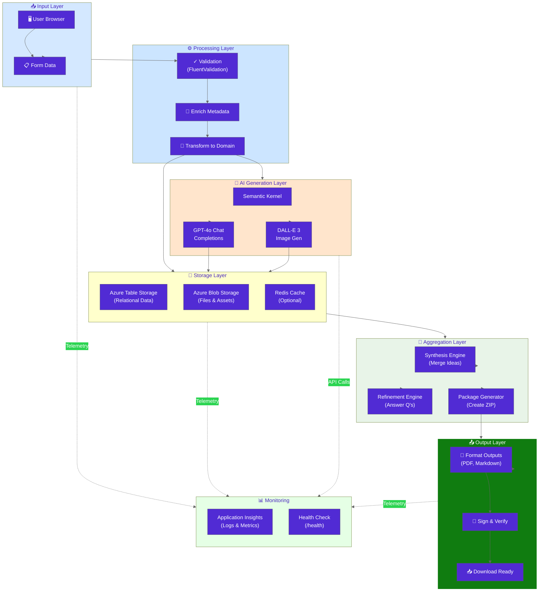
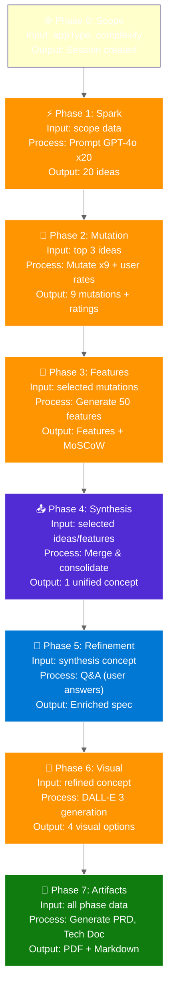
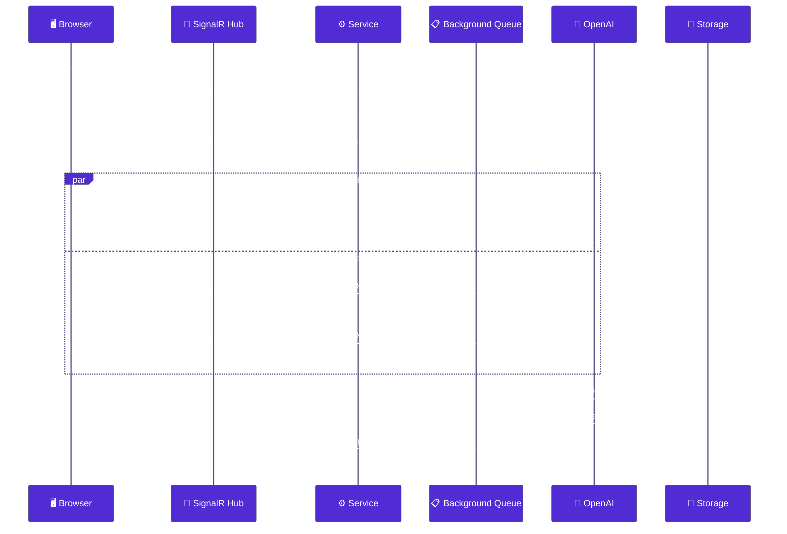
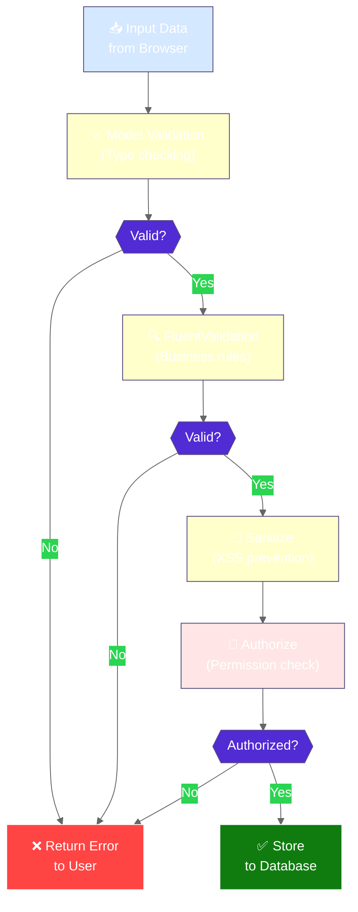
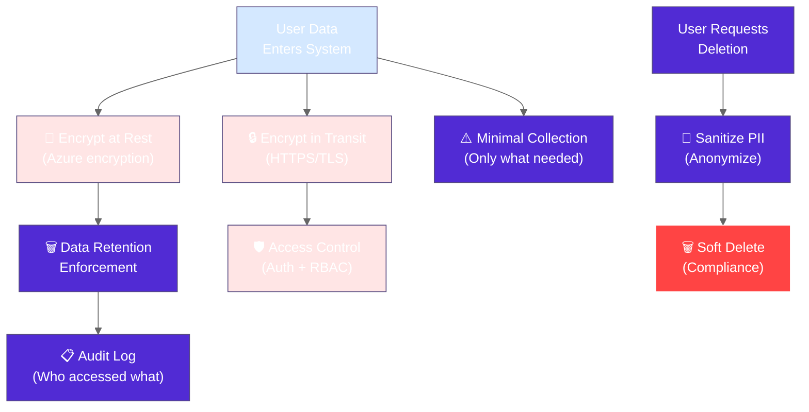

# PoAppIdea Data Pipeline

> **Version:** 2.0 (Enhanced)  
> **Last Updated:** 2026-02-12  
> **Audience:** Backend developers, DevOps, data architects

---

## 📊 Complete Data Pipeline Flow

### From User Input to Downloadable Artifacts



---

## 🔄 Phase-by-Phase Data Transformations

### How Data Evolves Through Each Phase



---

## 💾 CRUD Operations by Entity

### Create, Read, Update, Delete Patterns

#### SESSION
```
Create  → SessionService.CreateSession(userId, appType, complexity)
           → Inserts to Sessions table
           
Read    → SessionService.GetSession(sessionId)
           → Queries Sessions table
           
Update  → SessionService.UpdatePhase(sessionId, newPhase)
           → Updates Sessions row
           
Delete  → SessionService.DeleteSession(sessionId)
          → Soft-delete + cascade delete all related data
```

#### IDEA
```
Create  → SparkService.GenerateIdeas(sessionId, scope)
           → Call GPT-4o x20
           → Inserts 20 rows to Ideas table
           
Read    → IdeaRepository.GetIdeasBySession(sessionId)
           → Queries Ideas table with sessionId partition
           
Update  → IdeaRepository.UpdateIdea(idea) [rarely done]
           
Delete  → Auto-deleted when session deleted
```

#### SWIPE
```
Create  → Save on every swipe action
           → Inserts to Swipes table
           → Updates Idea ranking via SwipeScore
           
Read    → SwipeRepository.GetSwipesForSession(sessionId)
           → Returns ranked list
           
Delete  → Auto-deleted when session deleted
```

#### SYNTHESIS
```
Create  → SynthesisService.CreateSynthesis(sessionId, selectedIds)
           → Calls SynthesisEngine
           → Inserts to Synthesis table
           
Read    → SynthesisRepository.GetSynthesis(sessionId)
           
Update  → Update on refinement answers
           
Delete  → Deleted with session
```

#### ARTIFACT
```
Create  → ArtifactService.GenerateArtifacts(sessionId)
           → Call GPT-4o for content
           → Insert metadata to Artifacts table
           → Upload PDF/MD to Blob Storage
           
Read    → List artifacts by session
           → Download from Blob Storage
           
Delete  → Deleted with session
           → Blob file retention per policy
```

---

## 🚀 Async Pipeline Architecture

### Non-Blocking Long-Running Operations



---

## 📝 Data Validation Pipeline

### Input Validation & Sanitization



---

## 🔄 Data Consistency & Transactions

### Ensuring Data Integrity

| Scenario | Strategy | Guarantees |
|----------|----------|-----------|
| **Create Session** | Atomic insert | All-or-nothing |
| **Save Swipe** | Row-level transaction | Single swipe persists |
| **Aggregate Synthesis** | Multi-row update | Consistent merge |
| **Delete Session** | Cascade delete with soft-delete | GDPR compliance |
| **Download Artifacts** | Read-after-write consistency | User gets fresh data |

---

## 📊 Data Volume Estimates

### Expected Data Sizes

```
Per Complete Session:
  ├── Session metadata: ~2 KB
  ├── 20 Ideas × 500 B each: ~10 KB
  ├── 100 Swipes × 200 B each: ~20 KB
  ├── 9 Mutations × 800 B each: ~7 KB
  ├── 50 Features × 600 B each: ~30 KB
  ├── Synthesis + Answers: ~15 KB
  ├── Visual Asset (PNG): ~2-3 MB
  └── Artifacts (PDFs): ~500 KB
  ─────────────────────────
  Total per session: ~3 MB

Projection (1,000 sessions/month):
  Monthly: 3 GB
  Yearly: 36 GB
  Queries: ~10M/month
  Capacity: ✅ Well within budget
```

---

## 🔐 Data Privacy in Pipeline

### GDPR & Privacy Compliance



---

## 📈 Monitoring Data Pipeline Health

### Observability & Metrics

| Metric | Target | Alert Threshold |
|--------|--------|---|
| **Pipeline Latency** | <30s for AI requests | >60s |
| **Storage Write Latency** | <100ms | >500ms |
| **Data Validation Success Rate** | >99.9% | <99% |
| **Cache Hit Rate** | >80% | <60% |
| **Error Rate** | <0.1% | >0.5% |
| **PII Exposure** | 0 incidents | 1+ = incident |

Each metric is tracked in ApplicationInsights and alerted via Azure Monitor.

