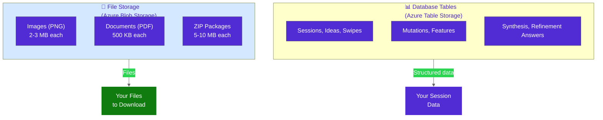
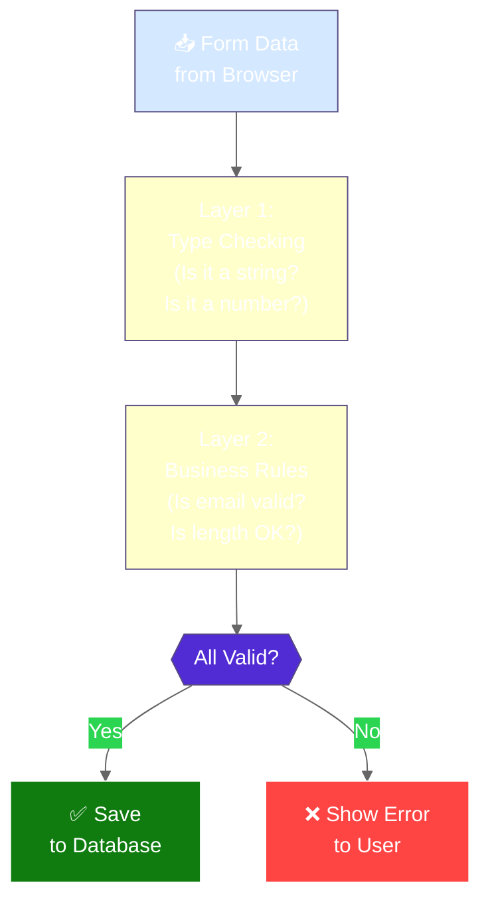

# PoAppIdea Data Pipeline (Simplified)

> **Version:** 1.0 (Simplified for Quick Reference)  
> **Last Updated:** 2026-02-12  
> **Audience:** Frontend developers, QA engineers

---

## 🔄 How Data Moves Through the System


---

## 📊 The 7 Phases of Data

### What Gets Created at Each Step

```
Phase 0: Scope
├── Input: App type, complexity
└── Output: Session record

Phase 1: Spark
├── Input: Session metadata
├── AI: Generates 20 ideas (GPT-4o)
└── Output: 20 Idea records

Phase 2: Mutation
├── Input: Top 3 ideas
├── AI: Evolves 9 mutations (GPT-4o)
└── Output: 9 Mutation records + your ratings

Phase 3: Features
├── Input: Selected mutations
├── AI: Generates 50 features (GPT-4o)
└── Output: 50 Feature records

Phase 4: Synthesis
├── Input: Selected ideas + features
├── AI: Merges into 1 concept (GPT-4o)
└── Output: 1 Synthesis record

Phase 5: Refinement
├── Input: Synthesis + your answers
├── AI: Generates questions (GPT-4o)
└── Output: 10 RefinementAnswer records

Phase 6: Visual
├── Input: Refined concept + style
├── AI: Generates image (DALL-E 3)
└── Output: Visual Asset (PNG file)

Phase 7: Artifacts
├── Input: All phase data
├── AI: Generates documents (GPT-4o)
└── Output: PRD, Tech Spec, ZIP package
```

---

## 💾 Where Data Gets Stored



---

## ✓ Validation: Does Data Get Checked?

### Yes! Multi-Layer Validation



---

## 🚀 Async Processing (Non-Blocking)

### The App Stays Responsive While AI Works

```
Traditional (Bad):
  Click "Generate" → WAIT 30 seconds → See Results ❌

PoAppIdea (Good):
  Click "Generate" → Immediately see "Generating..."
                  → Updates: "25% done...", "50% done...", "75% done..."
                  → See Results ✅
```

**How?** We use async/await + SignalR = instant feedback!

---

## 📈 Data Size Reality Check

### "Will This Use a Lot of Storage?"

**Per Complete Session:**
```
Session metadata:     2 KB
Ideas:               10 KB
Swipes:              20 KB
Mutations:           7 KB
Features:            30 KB
Synthesis + Q&A:     15 KB
Images (PNG):        2-3 MB ← Biggest!
Documents (PDFs):    500 KB
────────────────────────
TOTAL:              ~3 MB per session
```

**Scale:**
```
100 sessions/month:    300 MB/month
1,000 sessions/month:  3 GB/month
1 year (1k/mo):        36 GB/year ← Very manageable
```

**Cost:** Negligible (< $1/month for storage)

---

## 🔄 Real Example: You Swipe on an Idea

### Behind the Scenes

```
1. You see SwipeCard component
   "A social app for dog lovers"

2. You swipe RIGHT (like it)
   └─> SwipeCard records: direction=RIGHT, speed=FAST

3. SparkService.RecordSwipe(ideaId, RIGHT, FAST)
   └─> Calculates score: RIGHT × FAST = +8 points

4. ISwipeRepository.SaveSwipe(swipeRecord)
   └─> Sends to Azure Table Storage

5. Azure Table Storage
   └─> Inserts row to Swipes table

6. SignalR notifies browser
   └─> "Swipe saved! Moving to next idea..."

7. Browser shows next idea card
   └─> Back to step 1

All happens in < 1 second! ⚡
```

---

## 🛡️ Is My Data Safe?

### Security in the Pipeline

| Step | Protection |
|------|-----------|
| **In Transit** | HTTPS (encrypted connection) |
| **At Rest** | Azure encryption (automatic) |
| **In Database** | Only you can access |
| **On Download** | PDF signed for authenticity |
| **On Deletion** | Soft-deleted (audit trail kept) |

---

## 📊 Monitoring the Pipeline

### How We Know Everything Works

```
What We Track:
├── ✅ Data arrives from browser
├── ✅ Validation passes/fails
├── ✅ AI requests sent/received
├── ✅ Database saves succeed/fail
├── ✅ Files upload successfully
└── ✅ User downloads happen

All tracked → Application Insights dashboard → Alerts if problems
```

