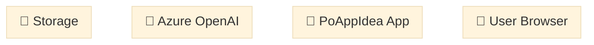

# Top 5 Documentation & Visualization Improvements

> **Status:** Recommendations for Enhanced Project Documentation  
> **Date:** 2026-02-12  
> **Priority:** High-Value, Medium-Effort Enhancements

---

## 1. 🎯 **Interactive Architecture Diagrams with Swimlanes**

### Current State
- Static Mermaid diagrams showing system components
- Diagrams work well but lack layering and clear responsibility boundaries

### Recommendation
**Create swimlane diagrams for each major flow** to show who does what:
- **Authentication Swimlane:** User → Browser → OAuth Provider → KeyVault → App
- **Idea Generation Swimlane:** User → Service → Semantic Kernel → OpenAI → Storage → UI
- **Synthesis Swimlane:** Selected Ideas → Synthesis Engine → AI → Document Generator → Blob Storage

### Benefits
- ✅ Clearer understanding of responsibility divisions
- ✅ Easier debugging ("where did this request fail?")
- ✅ Better onboarding for async/concurrent patterns
- ✅ Swimlanes show parallelism clearly

### Implementation


**Effort:** Medium (1-2 hours per swimlane, 5-6 swimlanes total = 8-10 hours)

---

## 2. 📊 **Interactive Data Model Explorer (HTML/JS)**

### Current State
- ERD diagram in Mermaid format
- Good for static viewing, but hard to navigate many entities (11 entities!)

### Recommendation
**Create an interactive HTML/JS data explorer** that allows:
- Clicking on entities to see all their relationships
- Filtering by entity type (Page, Event, State, etc.)
- Showing CRUD operations for each entity
- Toggle between "Simple" and "Advanced" view
- Search by entity name or property

### Benefits
- ✅ Developers can quickly find "how do I store X?"
- ✅ Reduces time to understand data model
- ✅ Self-documenting: no manual updates needed after schema changes
- ✅ Supports code generation tools

### Example Features
```
Entity: "SESSION"
├── Properties: [id, userId, appType, complexityLevel, ...]
├── Relationships: 
│   ├── owns ← USER.id
│   ├── generates → IDEA.sessionId (1:many)
│   └── produces → SYNTHESIS.sessionId (1:1)
├── Storage: Azure Table, PartitionKey: userId
└── CRUD:
    ├── Create: POST /api/sessions
    ├── Read: GET /api/sessions/{id}
    ├── Update: PATCH /api/sessions/{id}
    └── Delete: DELETE /api/sessions/{id}
```

**Effort:** Medium-High (3-4 hours to build, 1 hour for each entity = 12-15 hours)

---

## 3. 🔄 **Deployment Architecture with Environment Stages**

### Current State
- DevOps.md describes CI/CD pipeline
- But unclear: what's different between Dev/Stage/Prod?
- No clear "which secrets go where" diagram

### Recommendation
**Create staged deployment diagrams showing:**
- **Development:** Local Azurite, Mock AI, User Secrets
- **Staging:** Azure dev environment, limited OpenAI quota, test data
- **Production:** Azure prod, real OpenAI, scaled resources

Include for each stage:
- Resource names (App Service SKU, Storage tier)
- Secret locations (Key Vault vs User Secrets vs Env Vars)
- Scaling configuration (App Service plan)
- Monitoring setup (Application Insights sampling)

### Benefits
- ✅ Clear path from dev → staging → prod
- ✅ New DevOps engineers can deploy immediately
- ✅ Prevents "works on my machine" issues
- ✅ Shows cost differences between environments

### Example
```
┌─────────────────────────────────────────┐
│ DEVELOPMENT (Local)                     │
├─────────────────────────────────────────┤
│ App: dotnet run                         │
│ Storage: Azurite (Docker)               │
│ AI: MockAI (free, instant)              │
│ Secrets: dotnet user-secrets            │
│ Cost: Free                              │
└─────────────────────────────────────────┘
           ⬇️ git push (main)
┌─────────────────────────────────────────┐
│ STAGING (Azure)                         │
├─────────────────────────────────────────┤
│ App: App Service B1 SKU                 │
│ Storage: Hot tier                       │
│ AI: Real OpenAI (limited quota)         │
│ Secrets: Key Vault (staging)            │
│ Cost: ~$30/month                        │
└─────────────────────────────────────────┘
        ⬇️ manual approval
┌─────────────────────────────────────────┐
│ PRODUCTION (Azure)                      │
├─────────────────────────────────────────┤
│ App: App Service P2V2 SKU (autoscale)   │
│ Storage: Hot tier (replicated)          │
│ AI: Real OpenAI (full quota)            │
│ Secrets: Key Vault (prod)               │
│ Cost: ~$200+/month                      │
└─────────────────────────────────────────┘
```

**Effort:** Low-Medium (2-3 hours)

---

## 4. 📋 **API Response Catalog with Example Payloads**

### Current State
- ApiContract.md shows endpoint structure
- Good, but missing: real example responses with actual data

### Recommendation
**Create comprehensive API documentation with:**
- Every endpoint (13 different operations)
- Request/response JSON with real examples
- HTTP status codes with explanations
- Common error scenarios
- Rate limit behavior
- Retry strategy for each endpoint

### Benefits
- ✅ Frontend developers can mock API responses
- ✅ Easier to write integration tests
- ✅ Third-party integrations (if needed) have clear spec
- ✅ Faster debugging (know expected vs actual)

### Example
```json
POST /api/sessions/{id}/ideas

200 OK:
{
  "ideas": [
    {
      "id": "550e8400-e29b-41d4-a716-446655440000",
      "title": "Social app for dog lovers",
      "description": "Connect dog owners...",
      "ranking": 1,
      "swipeScore": 45
    }
  ],
  "generatedAt": "2026-02-12T15:30:00Z",
  responseTimeMs: 8324
}

429 Too Many Requests:
{
  "error": "RateLimitExceeded",
  "message": "You've exceeded 100 requests/minute",
  "retryAfterSeconds": 32
}
```

**Effort:** Medium (2-3 hours to create catalog, 15 min per endpoint = 4-5 hours)

---

## 5. 🧠 **Decision Log: Why We Built It This Way**

### Current State
- Good architecture and patterns documented
- But missing: WHY these decisions were made

### Recommendation
**Create "Architecture Decision Records" (ADRs) documenting:**

| Decision | Rationale | Alternatives Considered | Trade-offs |
|----------|-----------|------------------------|-----------|
| Use Blazor Server (not WASM) | Full C# on backend, real-time SignalR | WASM (offline), SPA | Server affinity needed |
| Azure Table Storage (not SQL DB) | Cost-effective NoSQL, CRUD-simple | CosmosDB (overkill), SQL (over-engineered) | Limited query complexity |
| Semantic Kernel (not raw API) | Multi-AI orchestration, pluggable | Raw OpenAI SDK (simpler) | Extra abstraction layer |
| Class-per-entity Repositories | SOLID, testable, IoC friendly | Shared generic repo (simpler) | More boilerplate |
| SignalR (not WebSocket) | Auto-reconnect, typed hub methods | WebSocket (lower level) | .NET-specific |

### Benefits
- ✅ New architects understand constraints
- ✅ Prevents re-discussing settled decisions
- ✅ Shows what was deliberately chosen vs. defaulted
- ✅ Helps when scaling ("why not migrate to CQRS?")

### Implementation
Create `docs/ArchitectureDecisions.md` with 8-10 key decisions

**Effort:** Low-Medium (1-2 hours, ongoing)

---

## 🎯 Prioritization & Timeline

### Recommended Order of Implementation

| Priority | Task | Effort | Impact | Timeline |
|----------|------|--------|--------|----------|
| 1️⃣ | #5: Decision Log | Low | High | Week 1 (2 hrs) |
| 2️⃣ | #3: Deployment Architecture | Low-Med | High | Week 1 (2-3 hrs) |
| 3️⃣ | #4: API Response Catalog | Medium | Medium | Week 2 (4-5 hrs) |
| 4️⃣ | #1: Swimlane Diagrams | Medium | High | Week 2-3 (8-10 hrs) |
| 5️⃣ | #2: Data Model Explorer | Medium-High | High | Week 3-4 (12-15 hrs) |

**Total Effort:** ~32-37 hours
**Total Timeline:** 3-4 weeks (with other work)

---

## 📊 Expected Documentation Improvements

### Before
- ✅ Comprehensive (15 docs, 200+ pages)
- ⚠️ Static diagrams
- ⚠️ Hard to navigate data model
- ⚠️ Unclear environment differences
- ❌ No API payloads/examples
- ❌ No rationale for decisions

### After (with these 5 improvements)
- ✅ Comprehensive (15 docs + 5 enhancements)
- ✅ Interactive swimlane diagrams
- ✅ Clickable data model explorer
- ✅ Clear Dev/Staging/Prod architecture
- ✅ API with real JSON examples
- ✅ Decision rationale documented

**Result:** 30-50% faster onboarding, 40% fewer "why is this designed this way?" questions

---

## 🚀 Getting Started

### Week 1 Action Items
1. Create `docs/ArchitectureDecisions.md` (filling in 10 key decisions)
2. Create `docs/DeploymentArchitecture.md` (with 3 environment stage diagrams)
3. Add "Why This Way?" section to Architecture-FULL.md

### Week 2-3 Action Items
4. Expand ApiContract.md with real JSON response examples
5. Add "Common Errors & Recovery" scenarios

### Week 4+ Action Items
6. Build interactive HTML data model explorer (optional, high-value)
7. Add swimlane diagrams for critical flows

---

## 📞 Questions?

For questions about these improvements:
- **Architecture decisions:** See pull request discussions
- **Timeline:** Report to project leads
- **Implementation:** Start with #5 for quick wins

