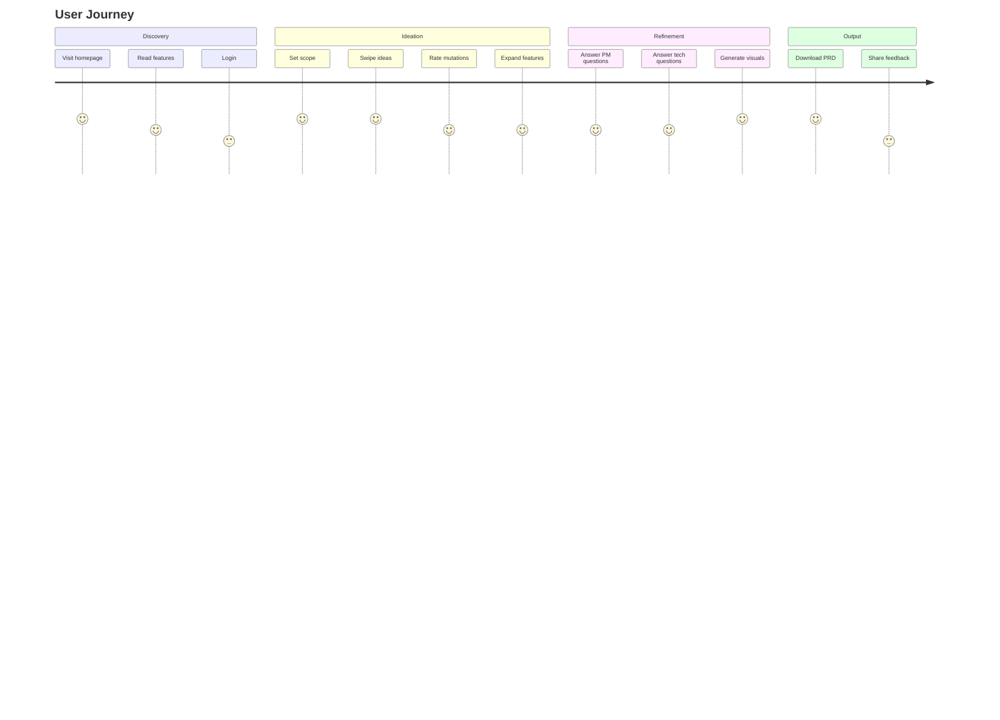

# PoAppIdea Product Specification

> **Version:** 1.0  
> **Last Updated:** 2026-02-12  
> **Status:** Active Development

---

## 📋 Executive Summary

PoAppIdea is an AI-powered ideation platform that transforms vague app concepts into professional product specifications through an engaging, Tinder-style swiping experience combined with multi-stage AI refinement.

### Problem Statement

- **Problem:** Product creators struggle to evolve vague ideas into actionable specifications
- **Solution:** AI-guided ideation journey with gamified interaction
- **Target Users:** Entrepreneurs, product managers, developers, and hobbyists

---

## 🎯 Product Vision

> "Transform the chaos of brainstorming into a structured, AI-powered journey that transforms a spark of inspiration into a complete, production-ready product specification."

---

## 👥 Target Audience

| Segment | Description | Pain Points |
|---------|-------------|-------------|
| **Entrepreneurs** | Startup founders with app ideas | Don't know where to start, overwhelmed by complexity |
| **Product Managers** | PMs validating concepts | Need quick prototyping, stakeholder alignment |
| **Indie Developers** | Solo developers exploring ideas | Limited time, need structure |
| **Hobbyists** | Non-technical idea generators | No technical background, need guidance |

---

## 📊 Success Metrics

### Primary Metrics (North Star)

| Metric | Target | Description |
|--------|--------|-------------|
| **Sessions Completed** | 1000+/month | Total completed ideation sessions |
| **Completion Rate** | >60% | Sessions reaching artifact generation |
| **NPS Score** | >50 | Net Promoter Score |

### Secondary Metrics

| Metric | Target | Description |
|--------|--------|-------------|
| **Time to Completion** | <45 min | Average session duration |
| **Artifacts Downloaded** | >70% | Users who download at least one artifact |
| **Return Users** | >30% | Users starting second session |
| **Gallery Imports** | >10% | Sessions importing from public gallery |

### Technical Metrics

| Metric | Target | Description |
|--------|--------|-------------|
| **API Availability** | >99.9% | Uptime percentage |
| **AI Response Time** | <30s | P95 latency for AI generation |
| **Page Load Time** | <3s | First contentful paint |

---

## 🏗️ Feature Requirements

### Phase 0: Scope Setup
- [x] App type selection (Web, Mobile, Desktop, etc.)
- [x] Complexity slider (1-5)
- [x] Session creation with unique ID

### Phase 1: Spark (Ideation)
- [x] Generate 20 AI-powered app ideas
- [x] Tinder-style swipe interface (Left=Pass, Right=Like)
- [x] Speed-based ranking (Fast=Strong preference)
- [x] Top 3 selection

### Phase 2: Mutation (Evolution)
- [x] Generate 9 mutations from top 3 ideas
- [x] AI-powered concept combination
- [x] Rating system (1-5 stars)
- [x] Keep top-rated mutations

### Phase 3: Feature Expansion
- [x] Generate 50 detailed features
- [x] MoSCoW prioritization (Must/Should/Could/Won't)
- [x] Category organization
- [x] User confirmation flow

### Phase 4-5: Refinement
- [x] Product Manager questions (5-10)
- [x] Technical Architect questions (5-10)
- [x] Dynamic question generation
- [x] Answer persistence

### Phase 6: Visual
- [x] DALL-E 3 image generation
- [x] Multiple style options
- [x] User selection
- [x] High-res download

### Phase 7: Artifacts
- [x] PRD generation
- [x] Technical documentation
- [x] Visual asset packaging
- [x] Multi-format download (PDF, Markdown)

---

## 🔄 User Journey Map

---

## 🎨 Product Personality

| Attribute | Value | Rationale |
|-----------|-------|-----------|
| **Tone** | Encouraging, Professional | Balance fun interaction with serious output |
| **Style** | Modern, Clean | Visual design reflects the quality of output |
| **Values** | Innovation, Accessibility, Quality | Democratize product planning |

---

## 📱 Supported Platforms

| Platform | Status | Notes |
|----------|--------|-------|
| Web (Desktop) | ✅ Primary | Full feature support |
| Web (Mobile) | ✅ Responsive | Adapted UI |
| PWA | 🔄 Future | Installable app |
| Native Mobile | 🔄 Future | iOS/Android apps |

---

## 🔐 Authentication Providers

| Provider | Status | Use Case |
|----------|--------|----------|
| Google | ✅ Enabled | Consumer users |
| GitHub | ✅ Enabled | Developer users |
| Microsoft | ✅ Enabled | Enterprise users |
| Anonymous | 🔄 Future | Try without login |

---

## 💰 Business Model

### Current: Free Tier
- Full ideation journey
- Basic artifact generation
- Limited gallery access

### Future: Premium Tiers
- Unlimited sessions
- Priority AI processing
- Advanced templates
- Team collaboration
- API access

---

## 🚀 Roadmap

### v1.0 (Current)
- [x] Core ideation flow
- [x] Basic artifact generation
- [x] OAuth authentication
- [x] Azure deployment

### v1.1 (Q2 2026)
- [ ] Gallery improvements
- [ ] Team features
- [ ] Template library

### v1.2 (Q3 2026)
- [ ] API access
- [ ] Webhooks
- [ ] Advanced analytics

### v2.0 (Q4 2026)
- [ ] Native mobile apps
- [ ] PWA support
- [ ] Premium tiers

---

## ✅ Acceptance Criteria

### Functional Criteria

| ID | Criterion | Test Scenario |
|----|-----------|---------------|
| F1 | User can start session with app type | Create session, verify AppType saved |
| F2 | User can swipe on 20 ideas | Complete swipe flow, verify top 3 |
| F3 | User can generate mutations | Generate mutations, verify 9 returned |
| F4 | User can prioritize features | Set MoSCoW, verify saved |
| F5 | User can answer refinement questions | Submit answers, verify persistence |
| F6 | User can generate visuals | Generate DALL-E images, verify URLs |
| F7 | User can download artifacts | Generate and download PRD |

### Non-Functional Criteria

| ID | Criterion | Threshold |
|----|-----------|-----------|
| NF1 | Page load time | <3 seconds |
| NF2 | API response time | <500ms (non-AI) |
| NF3 | AI generation time | <30 seconds |
| NF4 | Uptime | 99.9% |
| NF5 | Concurrent users | 100+ |

---

## 📞 Support & Feedback

- **Email:** support@poappidea.com
- **GitHub Issues:** github.com/punkouter26/PoAppIdea/issues
- **Documentation:** docs.poappidea.com

---

# 📋 Simplified Product Spec

## What is PoAppIdea?
AI-powered platform that transforms app ideas into professional specifications through 7-phase journey.

## Key Metrics
- 1000+ sessions/month
- 60%+ completion rate
- <45 min average session

## User Flow
1. **Scope** → App type + complexity
2. **Spark** → Swipe 20 AI ideas → Top 3
3. **Mutate** → AI combines ideas → 9 variations
4. **Features** → 50 features with MoSCoW
5. **Refine** → PM + Tech questions
6. **Visual** → DALL-E mockups
7. **Artifacts** → PRD + Tech Doc

## Target Users
- Entrepreneurs, PMs, Developers, Hobbyists

## Tech Stack
- Blazor Server + .NET 10
- Azure OpenAI (GPT-4o, DALL-E 3)
- Azure Storage (Tables + Blobs)
- OAuth (Google, GitHub, Microsoft)
