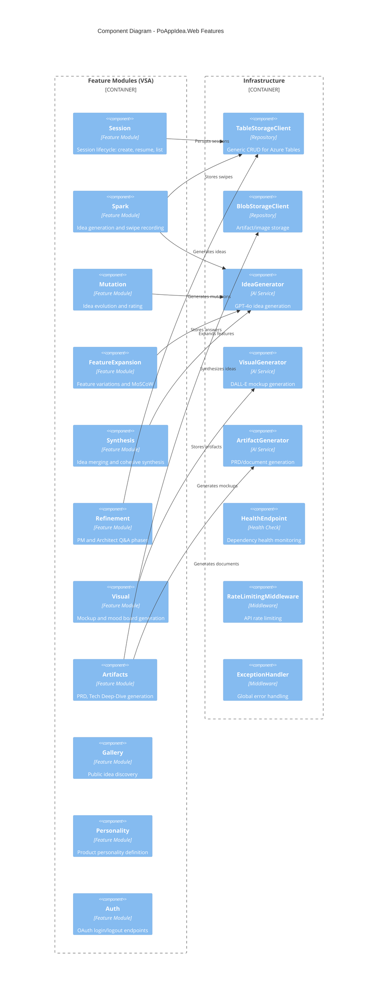

# C4 Component Diagram - PoAppIdea.Web

Component diagram showing the internal structure of the Web application.

## Feature Modules

| Module | Endpoints | Purpose |
|--------|-----------|---------|
| **Session** | 4 | Session CRUD and lifecycle |
| **Spark** | 3 | Idea generation, swipe recording, top ideas |
| **Mutation** | 4 | Idea mutation, rating, top mutations |
| **FeatureExpansion** | 4 | Feature variations, rating, top features |
| **Synthesis** | 4 | Idea selection, merging, synthesis |
| **Refinement** | 3 | PM/Architect questions and answers |
| **Visual** | 3 | Mockup generation and selection |
| **Artifacts** | 3 | PRD, Tech Deep-Dive, Visual Pack |
| **Gallery** | 2 | Public gallery browsing |
| **Personality** | 2 | Product personality management |
| **Auth** | 3 | OAuth login, logout, callback |

## Infrastructure Components

| Component | Type | Purpose |
|-----------|------|---------|
| **TableStorageClient** | Repository | Generic Azure Table operations |
| **BlobStorageClient** | Repository | Blob storage operations |
| **IdeaGenerator** | AI Service | Text generation via GPT-4o |
| **VisualGenerator** | AI Service | Image generation via DALL-E 3 |
| **ArtifactGenerator** | AI Service | Document generation |
| **HealthEndpoint** | Health Check | `/health` endpoint |
| **RateLimitingMiddleware** | Middleware | 100 req/60s rate limiting |
| **ExceptionHandler** | Middleware | Global error handling |
