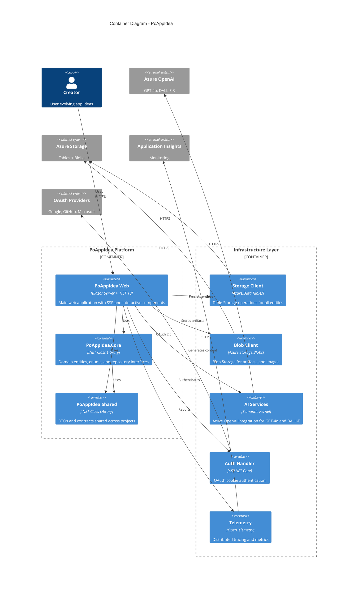

# C4 Container Diagram - PoAppIdea

Container diagram showing the internal structure of PoAppIdea.

## Containers

| Container | Technology | Purpose |
|-----------|------------|---------|
| **PoAppIdea.Web** | Blazor Server + Radzen | Main web application with 14 pages |
| **PoAppIdea.Core** | .NET 10 Library | 11 domain entities, enums, interfaces |
| **PoAppIdea.Shared** | .NET 10 Library | DTOs and contracts |

## Infrastructure Components

| Component | Technology | Purpose |
|-----------|------------|---------|
| **Storage Client** | Azure.Data.Tables | CRUD for 11 entity types |
| **Blob Client** | Azure.Storage.Blobs | Artifact and image storage |
| **AI Services** | Semantic Kernel | GPT-4o chat, DALL-E image generation |
| **Auth Handler** | ASP.NET Core Identity | OAuth authentication flow |
| **Telemetry** | OpenTelemetry | Traces, metrics, logs |
