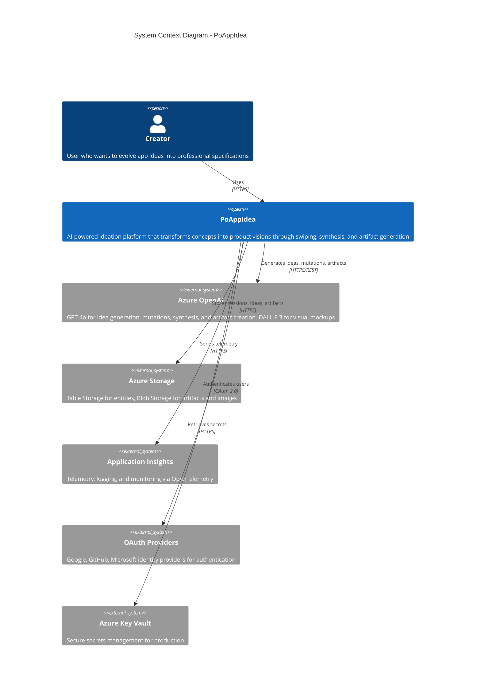

# C4 Context Diagram - PoAppIdea

System context diagram showing PoAppIdea and its external dependencies.

## Actors

| Actor | Description |
|-------|-------------|
| **Creator** | End user who brainstorms and evolves app ideas |

## External Systems

| System | Purpose |
|--------|---------|
| **Azure OpenAI** | AI backbone for idea generation (GPT-4o) and visual mockups (DALL-E 3) |
| **Azure Storage** | Persistence layer for all entities and generated artifacts |
| **Application Insights** | Observability and monitoring |
| **OAuth Providers** | User authentication via Google, GitHub, Microsoft |
| **Azure Key Vault** | Production secrets management |
