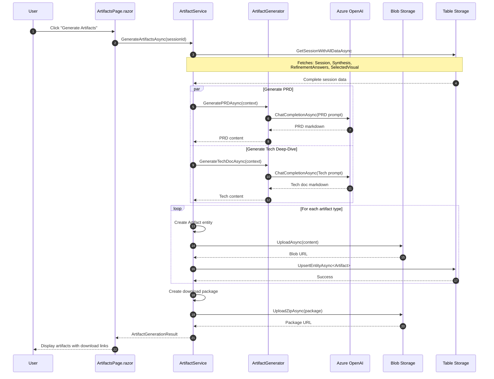

# Data Workflow - Artifact Generation

Sequence diagram showing how final artifacts are generated.



## Artifact Types

| Type | Description | Format |
|------|-------------|--------|
| **PRD** | Product Requirements Document | Markdown |
| **TechDeepDive** | Technical Architecture Document | Markdown |
| **VisualPack** | Selected mockups and style guide | Images + JSON |
| **DownloadPackage** | All artifacts bundled | ZIP |

## Context Aggregation

The artifact generator receives a complete context object:

```json
{
  "session": { "appType": "Mobile", "complexity": 4 },
  "synthesis": { "mergedConcept": "...", "thematicBridge": "..." },
  "pmAnswers": [ { "question": "...", "answer": "..." } ],
  "techAnswers": [ { "question": "...", "answer": "..." } ],
  "selectedVisual": { "style": "...", "palette": "..." }
}
```
