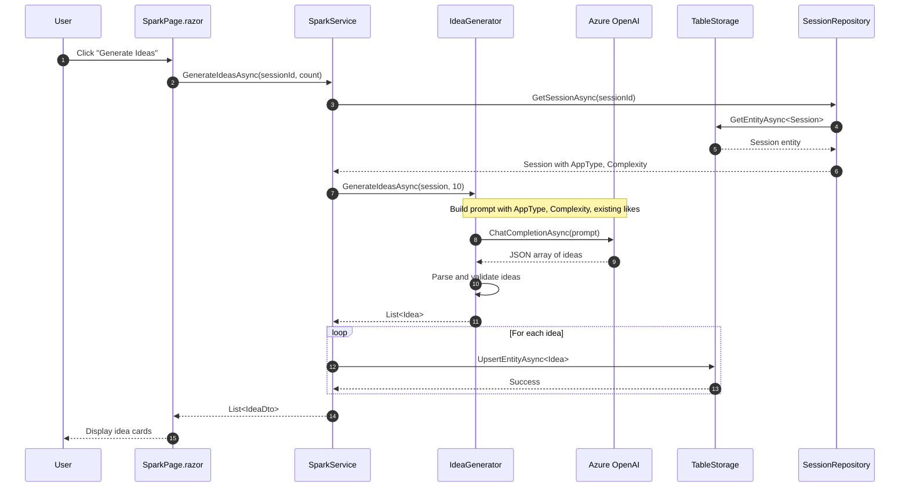

# Data Workflow - Idea Generation

Sequence diagram showing how ideas are generated in the Spark phase.

## Key Components

| Component | Responsibility |
|-----------|----------------|
| **SparkPage** | UI for swipe interface |
| **SparkService** | Orchestrates idea generation |
| **IdeaGenerator** | Builds prompts, calls OpenAI |
| **Azure OpenAI** | GPT-4o text generation |
| **TableStorage** | Persists ideas |
