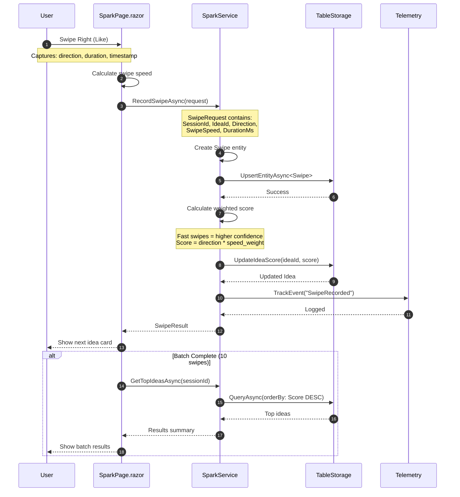

# Data Workflow - Swipe Recording

Sequence diagram showing how user swipes are recorded and processed.



## Swipe Speed Weighting

| Speed | Duration | Weight |
|-------|----------|--------|
| **Fast** | < 1s | 1.5x |
| **Normal** | 1-3s | 1.0x |
| **Slow** | 3-5s | 0.8x |
| **Hesitant** | > 5s | 0.5x |

## Data Model

```
Swipe {
    Id: Guid
    SessionId: Guid
    IdeaId: Guid
    Direction: Right/Left
    SwipeSpeed: Fast/Normal/Slow/Hesitant
    DurationMs: int
    CreatedAt: DateTimeOffset
}
```
