# Simplified Component Diagram

Quick-reference showing feature modules and data flow.

```mermaid
flowchart LR
    subgraph Frontend["🖥️ Blazor Pages"]
        login[Login]
        home[Home]
        spark[Spark Page]
        mutation[Mutation Page]
        features[Features Page]
        submit[Submission Page]
        refine[Refinement Page]
        visual[Visual Page]
        artifacts[Artifacts Page]
        gallery[Gallery]
    end

    subgraph Features["⚡ Feature Services"]
        sessionSvc[SessionService]
        sparkSvc[SparkService]
        mutationSvc[MutationService]
        featureSvc[FeatureExpansionService]
        synthesisSvc[SynthesisService]
        refineSvc[RefinementService]
        visualSvc[VisualService]
        artifactSvc[ArtifactService]
    end

    subgraph AI["🤖 AI Layer"]
        ideaGen[IdeaGenerator]
        visualGen[VisualGenerator]
        artifactGen[ArtifactGenerator]
    end

    subgraph Storage["💾 Storage"]
        tables[(Azure Tables)]
        blobs[(Azure Blobs)]
    end

    spark --> sparkSvc --> ideaGen
    mutation --> mutationSvc --> ideaGen
    features --> featureSvc --> ideaGen
    submit --> synthesisSvc --> ideaGen
    visual --> visualSvc --> visualGen
    artifacts --> artifactSvc --> artifactGen

    sparkSvc --> tables
    mutationSvc --> tables
    featureSvc --> tables
    synthesisSvc --> tables
    refineSvc --> tables
    visualSvc --> tables
    artifactSvc --> tables
    artifactSvc --> blobs

    style ideaGen fill:#10b981,color:#fff
    style visualGen fill:#10b981,color:#fff
    style artifactGen fill:#10b981,color:#fff
    style tables fill:#3b82f6,color:#fff
    style blobs fill:#3b82f6,color:#fff
```

## Service Quick Reference

| Service | AI Dependency | Storage |
|---------|--------------|---------|
| SparkService | IdeaGenerator | Tables |
| MutationService | IdeaGenerator | Tables |
| FeatureExpansionService | IdeaGenerator | Tables |
| SynthesisService | IdeaGenerator | Tables |
| RefinementService | None | Tables |
| VisualService | VisualGenerator | Tables |
| ArtifactService | ArtifactGenerator | Tables + Blobs |
