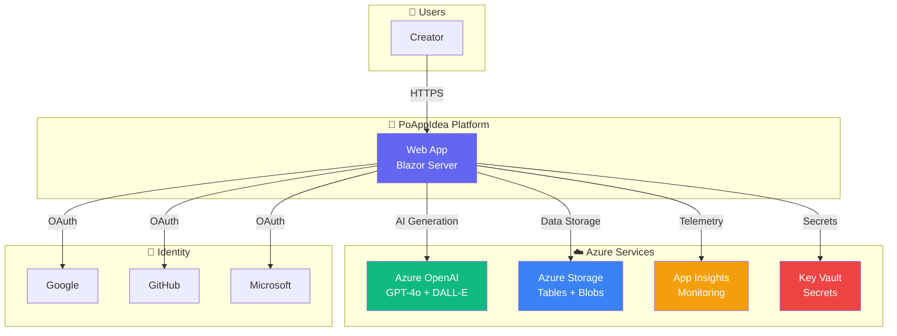

# Simplified C4 Context Diagram

Quick-reference architecture diagram for onboarding.

## Quick Reference

| Layer | What | Why |
|-------|------|-----|
| **Frontend** | Blazor Server + Radzen | Rich interactive UI with SSR |
| **AI** | Azure OpenAI (GPT-4o, DALL-E) | Idea generation, synthesis, visuals |
| **Storage** | Azure Tables + Blobs | Fast NoSQL + artifact storage |
| **Auth** | OAuth (Google, GitHub, MS) | Social login, no passwords |
| **Observability** | OpenTelemetry → App Insights | Full distributed tracing |
