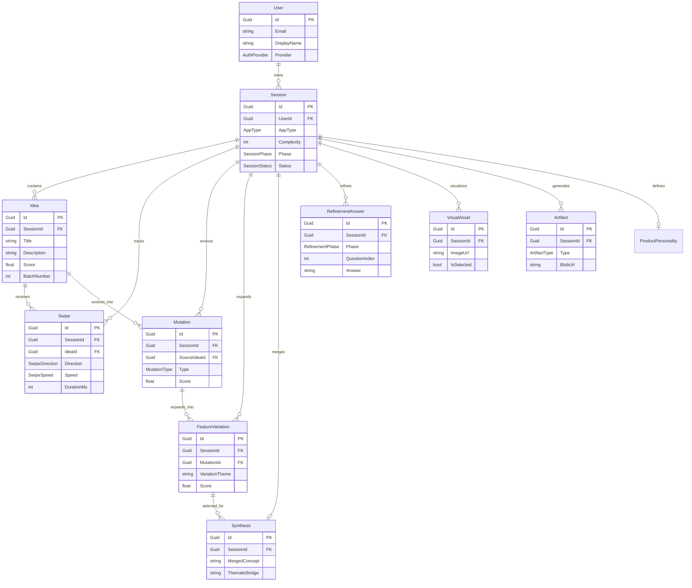

# Spaghetti Analysis - Entity Relationships

Visualization of entity dependencies and data flow.



## Entity Coupling Analysis

### High Fan-Out (Session)

Session is the central hub with 10 dependent entity types:

| Entity | Cardinality | Purpose |
|--------|-------------|---------|
| Idea | 1:N (20) | Generated ideas |
| Swipe | 1:N (20) | User interactions |
| Mutation | 1:N (9) | Evolved concepts |
| FeatureVariation | 1:N (50) | Feature variants |
| Synthesis | 1:1 | Merged concept |
| RefinementAnswer | 1:N (20) | Q&A responses |
| VisualAsset | 1:N (3) | Generated mockups |
| Artifact | 1:N (3) | Final documents |
| ProductPersonality | 1:1 | Product identity |

### Data Flow Pattern

```
User → Session → Ideas → Swipes
                    ↓
              Mutations → FeatureVariations
                    ↓
              Synthesis → RefinementAnswers
                    ↓
              VisualAssets → Artifacts
```

## Recommendations

1. **Partition Strategy**: Session-based partitioning in Table Storage (already implemented)
2. **Cascade Deletes**: Session deletion should cascade to all child entities
3. **Archive Pattern**: Move completed sessions to cold storage after 90 days
