# Spaghetti Analysis - Service Dependencies

Visualization of service coupling and dependency hotspots.

```mermaid
flowchart TB
    subgraph Hotspots["🔥 High-Coupling Hotspots"]
        storage[TableStorageClient<br/>🔴 Used by 11 services]
        session[SessionService<br/>🟠 Used by 8 features]
    end

    subgraph Features["Feature Services"]
        spark[SparkService]
        mutation[MutationService]
        feature[FeatureExpansionService]
        synthesis[SynthesisService]
        refine[RefinementService]
        visual[VisualService]
        artifact[ArtifactService]
        gallery[GalleryService]
        personality[PersonalityService]
    end

    subgraph AI["AI Services"]
        ideaGen[IdeaGenerator<br/>🟡 Used by 4 services]
        visualGen[VisualGenerator]
        artifactGen[ArtifactGenerator]
    end

    %% Storage dependencies (11 services)
    spark --> storage
    mutation --> storage
    feature --> storage
    synthesis --> storage
    refine --> storage
    visual --> storage
    artifact --> storage
    gallery --> storage
    personality --> storage
    session --> storage

    %% Session dependencies (8 features need session)
    spark -.-> session
    mutation -.-> session
    feature -.-> session
    synthesis -.-> session
    refine -.-> session
    visual -.-> session
    artifact -.-> session

    %% AI dependencies
    spark --> ideaGen
    mutation --> ideaGen
    feature --> ideaGen
    synthesis --> ideaGen
    visual --> visualGen
    artifact --> artifactGen

    style storage fill:#ef4444,color:#fff
    style session fill:#f97316,color:#fff
    style ideaGen fill:#eab308,color:#fff
```

## Coupling Analysis

### 🔴 Critical Hotspots (High Risk)

| Component | Dependents | Risk | Mitigation |
|-----------|------------|------|------------|
| **TableStorageClient** | 11 services | Single point of failure | Already uses retry policies |
| **SessionService** | 8 features | Cross-cutting concern | Consider caching layer |

### 🟡 Moderate Coupling

| Component | Dependents | Risk | Mitigation |
|-----------|------------|------|------------|
| **IdeaGenerator** | 4 services | AI rate limits | Queue-based processing |
| **BlobStorageClient** | 2 services | Low risk | Acceptable coupling |

### ✅ Well-Isolated

| Component | Dependents | Notes |
|-----------|------------|-------|
| **VisualGenerator** | 1 | Clean isolation |
| **ArtifactGenerator** | 1 | Clean isolation |
| **PersonalityService** | 0 | Leaf service |

## Recommendations

1. **Add Redis caching** for SessionService to reduce storage reads
2. **Implement Circuit Breaker** for IdeaGenerator AI calls
3. **Consider CQRS** for read-heavy gallery queries
