# User Journey - 6 Phase Flow

Complete user journey through the PoAppIdea ideation process.

```mermaid
flowchart TD
    subgraph Phase0["🔐 Authentication"]
        A1[Visit App] --> A2{Logged In?}
        A2 -->|No| A3[OAuth Login]
        A3 --> A4[Google / GitHub / Microsoft]
        A4 --> A2
        A2 -->|Yes| H1
    end

    subgraph Home["🏠 Dashboard"]
        H1[View Sessions] --> H2{Action?}
        H2 -->|New| S1
        H2 -->|Resume| S2[Continue Session]
        H2 -->|Browse| G1[Gallery]
    end

    subgraph Phase1["⚡ Phase 1: Spark"]
        S1[Configure Session] --> S1a[Select App Type]
        S1a --> S1b[Set Complexity 1-5]
        S1b --> SP1[Generate 10 Ideas]
        SP1 --> SP2[Swipe Interface]
        SP2 --> SP3{Swipe}
        SP3 -->|👍 Like| SP4[Record + Speed]
        SP3 -->|👎 Dislike| SP4
        SP4 --> SP5{Batch Done?}
        SP5 -->|No| SP2
        SP5 -->|Yes, Batch 1| SP6[Generate Batch 2<br/>Based on Likes]
        SP6 --> SP2
        SP5 -->|Yes, Batch 2| SP7[Calculate Top 3]
        SP7 --> M1
    end

    subgraph Phase2["🧬 Phase 2: Mutations"]
        M1[Top 3 Ideas] --> M2[Generate 9 Mutations]
        M2 --> M3[Display Mutation Cards]
        M3 --> M4[Rate 1-5 Stars]
        M4 --> M5{Rated All?}
        M5 -->|No| M4
        M5 -->|Yes| M6[Calculate Top 10]
        M6 --> F1
    end

    subgraph Phase3["🎯 Phase 3: Features"]
        F1[Top 10 Mutations] --> F2[Expand to 50 Variations]
        F2 --> F3[MoSCoW Priorities]
        F3 --> F4[Rate Variations]
        F4 --> F5[Top 10 Proto-Apps]
        F5 --> SU1
    end

    subgraph Phase4["📤 Phase 4: Submission"]
        SU1[Select 1-10 Ideas] --> SU2{Multiple?}
        SU2 -->|No| SU3[Proceed to Refine]
        SU2 -->|Yes| SU4[AI Synthesis]
        SU4 --> SU5[Merged Concept]
        SU5 --> R1
        SU3 --> R1
    end

    subgraph Phase5["💬 Phase 5: Refinement"]
        R1[PM Questions] --> R2[Answer 10 Questions]
        R2 --> R3[Architect Questions]
        R3 --> R4[Answer 10 Questions]
        R4 --> V1
    end

    subgraph Phase6["🎨 Phase 6: Artifacts"]
        V1[Visual Direction] --> V2[Generate 3 Mockups]
        V2 --> V3[Select Style]
        V3 --> AR1[Generate Artifacts]
        AR1 --> AR2[PRD + Tech Doc + Visuals]
        AR2 --> AR3[Download Pack]
        AR3 --> DONE[✅ Complete!]
    end

    style Phase1 fill:#fef3c7
    style Phase2 fill:#d1fae5
    style Phase3 fill:#dbeafe
    style Phase4 fill:#fce7f3
    style Phase5 fill:#e0e7ff
    style Phase6 fill:#fef9c3
```

## Phase Summary

| Phase | Name | Input | Output | AI Calls |
|-------|------|-------|--------|----------|
| 0 | Auth | - | User session | 0 |
| 1 | Spark | App Type + Complexity | Top 3 Ideas | 2 |
| 2 | Mutations | Top 3 Ideas | Top 10 Mutations | 1 |
| 3 | Features | Top 10 Mutations | 50 Variations → Top 10 | 1 |
| 4 | Submission | 1-10 Selections | Synthesized Concept | 0-1 |
| 5 | Refinement | Concept | Answered Questions | 0 |
| 6 | Artifacts | Everything | PRD, Tech Doc, Visuals | 2-3 |
